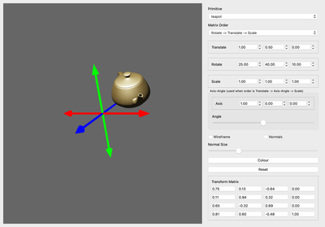

# AffineTransforms

A PBR-shaded primitive sits at the origin next to an RGB axis gizmo, and you
compose its translate/rotate/scale transform live from the panel. The point
is the *order* those three combine in: Rotate-Translate-Scale,
Translate-Rotate-Scale, and Translate-(axis-angle rotation)-Scale all give
you the same three ingredients but a different matrix, and moving the same
sliders under a different order sends the object somewhere completely
different. A read-only `Mat4Widget` shows the composed matrix as you go, so
you can watch the translation row rotate away under RTS and stay put under
TRS.

One thing that trips people up: the three combo-box labels name the matrix
*product*, not a left-to-right timeline — `Rotate -> Translate -> Scale`
means `R @ T @ S`. Points transform as `matrix @ point`, so the rightmost
term acts on the object first. That label therefore scales the object,
then translates it, then rotates it — the reverse of what the arrows
suggest at a glance. Read each label right-to-left to see what actually
happens to the object.

Simplified from the NGL9Demos original, which had five modes: the
hand-crafted "Gimbal Lock" mode poked raw matrix elements to exploit C++'s
memory layout directly, which doesn't port sensibly to Python, and
Translate-Euler-Scale was dropped as a near-duplicate of TRS with little
extra to teach once axis-angle is sat alongside it as the "does the axis
stay put" comparison.

```bash
cd AffineTransforms
uv run main.py
```



## Controls

- Primitive and Matrix Order combo boxes
- Translate / Rotate / Scale sliders, and an Axis / Angle pair for the
  axis-angle mode
- Wireframe and Normals checkboxes (the latter uses a geometry shader to
  draw the per-vertex and per-face normals, `shaders/normalGeo.glsl`), with
  a Normal Size slider
- Colour and Reset buttons
- Left-drag in the viewport orbits the camera, right-drag pans, wheel zooms

## Notes

- `axis.py` is a small standalone RGB gizmo (X red, Y green, Z blue) drawn
  with `DefaultShader.COLOUR`. It registers its own unit cylinder and cone
  the first time it draws, so every dimension comes from the `scale`
  argument (the half-length of each axis) and the proportions hold however
  big you draw it — borrowing the demo's own "cylinder"/"cone" instead gave
  a gizmo fatter than it was long. If you port the C++ NGL version, note
  that `PrimData.cylinder` is aligned down y and centred on the origin
  whilst `PrimData.cone` runs from the origin along +z, so the shaft and
  the head need different rotations to point the same way.
- Reuses `Camera/shaders/PBRVertex.glsl` and `PBRFragment.glsl` rather than
  porting AffineTransforms' own single-light PBR variant from NGL9Demos —
  one working PBR permutation is enough, the point of this demo is matrix
  order, not lighting.
- The control panel is plain PySide widgets in code, no `.ui` file, matching
  `MassSpring/main.py`'s precedent. The viewport is a `QOpenGLWindow`
  embedded via `QWidget.createWindowContainer` (`BVHViewer` and
  `SkinnedMeshImport` do the same); give the container `StrongFocus` and
  call `setFocus()` on it or keyboard input never reaches the window.

## WebGPU version

`main_webgpu.py` compares the same three matrix orders using a simpler
diffuse shader (no PBR) and a primitive selector limited to the baked mesh
set (`PrimData.primitive` has no sphere/cylinder/cone/disk/plane/torus data
— those are GL-only runtime tessellations). It omits the axis gizmo and the
geometry-shader normal visualisation; WebGPU has no geometry-shader stage
at all, which is why that feature is GL-only in the first place.
