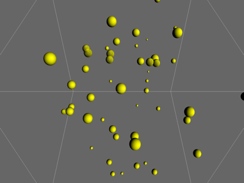

# BoundingBox

50 spheres (configurable via `--spheres N`) bounce around inside an
80-unit cubic bounding box, reflecting off any of its 6 walls. Sphere
count is adjustable live with `+`/`-` (never below 1). An optional,
off-by-default all-pairs sphere/sphere check can be toggled on top of
the wall collisions -- ported faithfully from
`NGL9Demos/Collisions/BoundingBox`, including its slightly odd pairwise
rule where a colliding pair's response is applied per comparison rather
than per pair: each sphere gets a turn as the "current" one in the
O(n^2) sweep, so within a single tick a colliding pair typically ends up
reversing both directions anyway.

## Controls
`space` : pause/resume, `s` : toggle sphere/sphere checking (off by default)
`r` : reset all spheres, `+`/`-` : add/remove a sphere (minimum 1)
`f` : fullscreen, `n` : windowed
Left-drag : orbit, Right-drag : pan, Wheel : zoom

## WebGPU version

`main_webgpu.py` reproduces the same default 50-sphere setup and
controls independently (minus `f`/`n` fullscreen, which has no WebGPU
`QWidget` equivalent here). The sphere count is capped at 200 -- a
fixed-size GPU buffer pool needs a ceiling, unlike the C++'s unbounded
array; the default behaviour (50 spheres, add/remove by 1) is unaffected.
