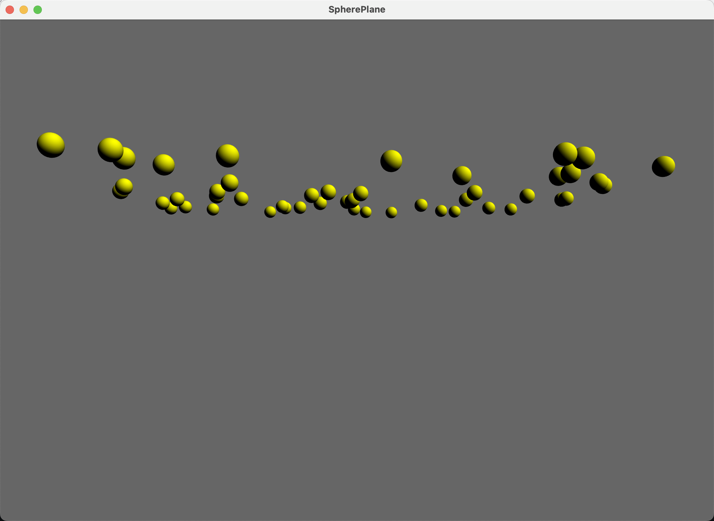

# SpherePlane

50 spheres (configurable via `--spheres N`) continuously fall and collide
with a 5x5 plane you can tilt. A colliding sphere switches to moving
along the plane's current normal and draws in wireframe; every 20 ticks
(~2.6s) all spheres respawn at a fresh random position above the plane,
hit or not. Ported faithfully from `NGL9Demos/Collisions/SpherePlane`,
including its camera -- eye and plane both sit at `y=0`, so with the
plane untilted you're looking along it edge-on and won't see it as a
filled quad; tilt it with the arrow keys to bring it into view. The
C++ also declares an `m_animate` flag it never wires up to a key, so
there's deliberately no pause control here either.

## Controls
`up`/`down` : tilt the plane about world X, `left`/`right` : tilt about world Z
Left-drag : orbit, Right-drag : pan, Wheel : zoom
