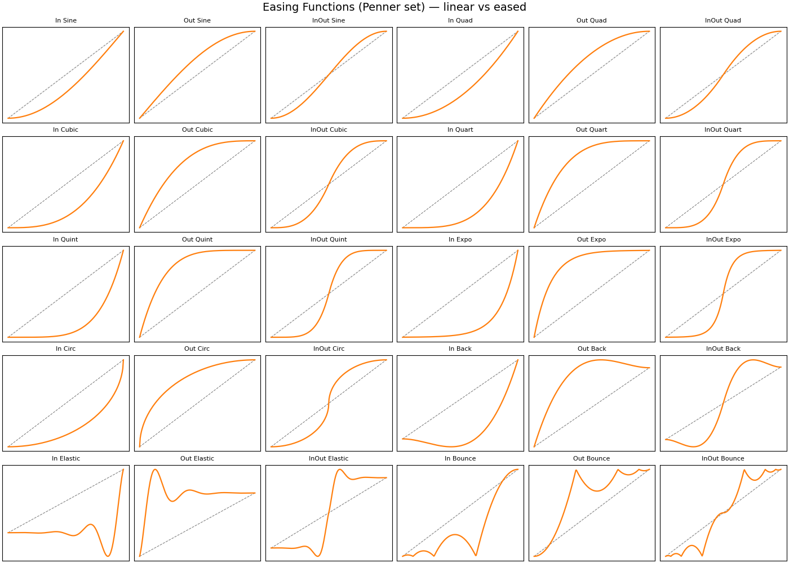

# Easing Functions

Extends the [Interpolation](../Interpolation) demo to the full set of
[Penner easing functions](https://easings.net) — sine, quad, cubic, quart,
quint, expo, circ, back, elastic, and bounce, each with In / Out / InOut
variants (30 in total).



Two teapots travel between the same start and end points:

- **Gold (top)** — plain linear interpolation, the reference.
- **Brass (bottom)** — the easing function currently selected in the combo box.

Because both teapots share the same start/end and the same clock, differences
in spacing and timing between linear and eased motion are directly visible.

The right-hand panel embeds a matplotlib canvas (`FigureCanvasQTAgg`) in the
Qt UI. It plots the selected easing curve against the linear ramp (dashed),
with a red marker tracking the current animation time. Back and elastic
curves overshoot outside [0, 1], and the plot's y-range adapts to show this.
Below the graph, an algorithm view shows the actual Python source of the
selected easing function (via `inspect.getsource`), including any constants
or helper functions it uses, so the curve and its implementation can be read
side by side.

All easing functions are pure scalar maths in [`easing.py`](easing.py)
mapping t ∈ [0, 1] → eased value, applied as `a + (b - a) * ease(t)`. They
are unit tested headlessly in [`tests/`](tests) (endpoints, InOut symmetry,
range, bounce continuity):

```bash
uv run pytest EasingFunctions/tests/
```

## Usage

```bash
uv run EasingFunctions/main.py
```

| Control | Action |
|---|---|
| Combo box | Select easing function (restarts the animation) |
| Space / Pause button | Toggle animation |
| Left / Right arrows | Scrub time when paused |
| LMB drag | Rotate scene |
| RMB drag | Pan scene |
| Mouse wheel | Zoom |
| W / S | Wireframe / solid |
| Esc | Quit |
