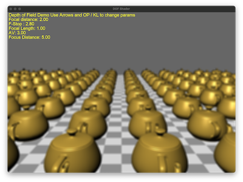

# Depth of Field Demo

This demo uses a two pass depth of field effect by running two Gaussian blur passes. The code is based on https://developer.nvidia.com/gpugems/gpugems3/part-iv-image-effects/chapter-28-practical-post-process-depth-field and
https://github.com/tsherif/webgl2examples

## References

- [GPU Gems 3, Ch. 28 — Practical Post-Process Depth of Field](https://developer.nvidia.com/gpugems/gpugems3/part-iv-image-effects/chapter-28-practical-post-process-depth-field) — the technique this demo is based on.
- [GPU Gems, Ch. 23 — Depth of Field: A Survey of Techniques](https://developer.nvidia.com/gpugems/gpugems/part-iv-image-processing/chapter-23-depth-field-survey-techniques) — circle of confusion and the DOF design space.
- [LearnOpenGL — Bloom](https://learnopengl.com/Advanced-Lighting/Bloom) — the separable two-pass Gaussian blur used by the blur passes.
