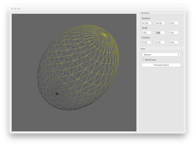

# PySide GUI

This demos show how to build a ui using Qt Designer and PySide6.

The ui file is loaded in and each of the attributes are placed into the class attributes.

@Signal and @Slot decorators are used to define signals and slots in the classes and connected to the corresponding slots.

## References

- [Qt for Python documentation](https://doc.qt.io/qtforpython-6/) — PySide6 reference.
- [Qt for Python — Signals and Slots](https://doc.qt.io/qtforpython-6/tutorials/basictutorial/signals_and_slots.html) — the `@Signal` / `@Slot` decorators used here.
- [Qt Designer Manual](https://doc.qt.io/qt-6/qtdesigner-manual.html) — building the `.ui` file.
- [QOpenGLWidget (Qt for Python)](https://doc.qt.io/qtforpython-6/PySide6/QtOpenGLWidgets/QOpenGLWidget.html) — embedding a GL viewport inside a widget layout.
