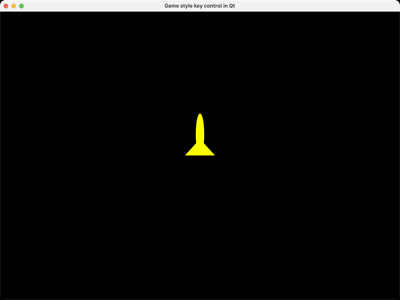

# GameKeyControl

A held-key spaceship demo, ported from `NGL9Demos/AdvancedGameKeyControl`.
This one's about *held* keys rather than key presses -- Up/Down/Left/Right/R
can all be down at once, and every combination has to move the ship
sensibly (Up+Left should be a diagonal, not whichever branch happened to
run last). Rather than a tree of if/elif checks, `game_controls.py`'s
`MOTION_TABLE` is a flat 32-entry lookup table indexed directly by the
held-key bitmask, so the "what does this combination of keys do" question
is answered once, offline, instead of every frame.

Space starts and stops recording every frame's bitmask to a `KeyRecorder`;
P replays a recording back over the ship's original starting position; S/L
save and load a recording to/from a `.kp` file. The maths and the recorder
live in `game_controls.py`, shared with the WebGPU version of this demo --
see that file for `move_ship()`, `ship_transform()`, and `KeyRecorder`. This
`.kp` format is a Python-native text encoding (one decimal integer per
line), not the raw byte stream the original C++ `AdvancedGameKeyControl`
writes for each frame, so a recording made by this port won't load in the
C++ demo or vice versa -- it's only interchangeable between this port's own
OpenGL and WebGPU entry points.

There's no mouse camera control here at all, which is unusual for this
repo -- the C++ source never wires up a mouse handler, so this port
doesn't either. The camera is one fixed `look_at`, set once in
`initializeGL`.

It also runs on two independent timers rather than this repo's usual one,
again matching the source: a 15ms timer samples the held keys and steps
the ship, and a separate 30ms timer only triggers a redraw. Sampling input
faster than you redraw is a reasonable thing to want in a game loop, and
it's the whole reason this demo has two timers instead of one.

## Controls
- Arrow keys : move the ship (held, not pressed -- diagonals work)
- `R` : rotate (held)
- `Space` : toggle recording
- `P` : toggle playback
- `S` / `L` : save / load a recording (`.kp` file)
- `Esc` : quit

## WebGPU version

`main_webgpu.py` needs no reinterpretation for this demo's actual teaching
point (the bitmask-indexed motion table and file-based record/playback are
plain Python/Qt, identical on both backends) -- the only backend-specific
work is drawing the ship and the HUD. `ncca.ngl.WebGPUMesh` uploads the same
parser-only OBJ data used by the OpenGL version, and a small hand-rolled flat WGSL shader
(`GameKeyControlShader.wgsl`) stands in for the OpenGL side's built-in
`nglColourShader` equivalent. A recording saved from either backend loads
and plays back correctly in the other -- the `.kp` format and the
`KeyRecorder` class are shared, unmodified, from `game_controls.py`.
