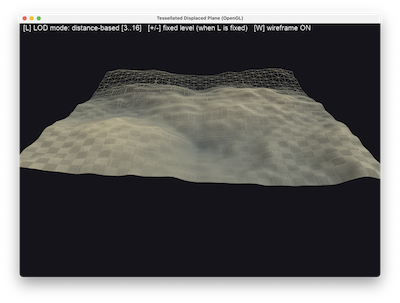

# Geometry & Tessellation Shaders



Two small, focused demos sharing one folder because they cover the two GL
pipeline stages that only exist on desktop GL/Vulkan, not WebGPU:

- **`normals_main.py`** — a geometry-shader normal visualiser: draws a
  teapot twice, once shaded normally and once with a second program whose
  geometry shader turns every triangle into 1-3 short lines along its
  normal(s).
- **`tess_main.py`** — a tessellated, noise-displaced plane: a 16x16 grid
  of `GL_PATCHES` subdivided by a tessellation control/evaluation shader
  pair, with distance-based level-of-detail.

Both are run independently; `RunDemos.py` discovers them automatically as
two entry points in the same folder.

## The 5 programmable pipeline stages

```
Vertex Shader
     |
     v
[ Tessellation Control Shader ]  --\
     |                              |  (fixed-function tessellator
     v                              |   generates new vertices from
[ Tessellation Evaluation Shader ]-/    gl_TessLevelOuter/Inner)
     |
     v
[ Geometry Shader ]
     |
     v
Fragment Shader
```

- `normals_main.py` exercises **Vertex -> Geometry -> Fragment** (no
  tessellation stages).
- `tess_main.py` exercises **Vertex -> Tess Control -> Tess Evaluation ->
  Fragment** (no geometry stage).
- Neither demo uses all 5 stages in one program at once — that's
  deliberately avoidable complexity; each demo isolates the stage pair it
  is teaching.

## Why OpenGL only 

**WebGPU has no geometry shader stage and no tessellation stages at all.**
This is not an oversight in `ncca.ngl`'s WebGPU backend; the WebGPU spec
itself only defines vertex, fragment and compute stages. Where a WebGPU
pipeline needs "a geometry shader" it reaches for a compute shader that
writes a vertex/index buffer (or storage buffer) which a normal vertex
shader then reads, and "tessellation" becomes either a fixed subdivision
scheme baked into the mesh, or displacement done per-vertex in a compute
pass with a fixed input resolution. Both are strictly more code than the
one-line `layout(...) in/out` declarations GLSL gives you here — which is
itself the teaching point: these two GL-only stages are a *convenience*
the GPU vendors specifically decided not to standardise into WebGPU,
because they map awkwardly onto modern tile-based/mobile GPU architectures
compared to compute-based equivalents.

## ShaderLib API check (read this before writing similar demos)

Per the task brief, `ncca.ngl.opengl.ShaderLib` (source:
`/Users/jmacey/teaching/Code/PyNGL`) was inspected for geometry/tessellation
stage support before writing any shader code:

- **Geometry shaders**: fully supported by the convenience entry point —
  `ShaderLib.load_shader(name, vert, frag, geo=<path>)` compiles and
  attaches a `GL_GEOMETRY_SHADER` alongside vertex/fragment. `Text`'s own
  built-in shader already uses this (`text_geometry.glsl`). Used as-is by
  `normals_main.py`.
- **Tessellation shaders**: `ShaderLib.load_shader()` has **no** `tesc`/
  `tese` parameters — the high-level convenience wrapper only ever wires
  up vertex/fragment/geometry. However, the *lower-level* API it is built
  on top of is not similarly limited: `ShaderType` (in
  `ncca/ngl/opengl/shader.py`) already defines `TESSCONTROL`/`TESSEVAL`
  mapping to `GL_TESS_CONTROL_SHADER`/`GL_TESS_EVALUATION_SHADER`, and
  `ShaderLib` exposes the per-stage building blocks that `load_shader`
  itself is implemented with: `create_shader_program`, `attach_shader`,
  `load_shader_source`, `compile_shader`, `attach_shader_to_program`,
  `link_program_object`.

**Outcome / path taken**: rather than writing a separate raw-PyOpenGL
`program.py` helper (the brief's fallback for when ShaderLib has *no*
usable path), `tess_main.py` drives the lower-level `ShaderLib` API
directly — see `load_tess_program()` at the top of that file. This keeps
the tessellation program registered in `ShaderLib` exactly like any other
shader (`ShaderLib.use(...)`, `ShaderLib.set_uniform(...)` etc. all work
unmodified), makes zero changes to the PyNGL library itself, and avoids
duplicating shader compilation/linking/error-handling in raw PyOpenGL. No
library edit was needed or made.

## `normals_main.py` — geometry-shader normal visualiser

| Key | Action |
| :-- | :-- |
| `F` | toggle vertex-normal mode (smooth) vs. face-normal mode (faceted) |
| `+` / `-` | increase / decrease the visualised normal length |
| LMB / RMB / wheel | rotate / pan / zoom, `Space` resets, `Esc` quits |

The geometry shader (`shaders/NormalLinesGeometry.glsl`) declares
`layout(triangles) in; layout(line_strip, max_vertices = 6) out;` — it
receives the vertex shader's per-vertex view-space position/normal for
all 3 triangle corners (`vPosView[3]`, `vNormalView[3]`) and, per triangle:

- **Vertex mode** (`F` off): emits one 2-vertex line per input vertex,
  starting at that vertex and running along *its own* interpolated
  normal — this is what makes smooth (Gouraud-style) shading normals
  visible as they fan out across a curved surface like the teapot body.
- **Face mode** (`F` on): averages the triangle's 3 positions and 3
  normals down to a single centre point and face normal, and emits one
  line from there — this is the "faceted" convention: one flat normal per
  triangle, matching what flat shading would use.

The result is drawn as a second full pass over the same teapot geometry
(same VAO, same attribute locations 0/1) with `ShaderLib.use()` switched
to the line-drawing program — geometry shaders don't require rebuilding
any vertex data, only a different program bound at draw time.

## `tess_main.py` — tessellated displaced plane

| Key | Action |
| :-- | :-- |
| `L` | toggle distance-based LOD vs. a fixed tessellation level |
| `+` / `-` | (fixed-level mode only) raise / lower the fixed level |
| `W` | toggle wireframe — **this is the whole point of the demo** |
| LMB / RMB / wheel | rotate / pan / zoom, `Space` resets, `Esc` quits |

Pipeline, in order:

1. **Vertex shader** (`TessPlaneVertex.glsl`) — passes each of the grid's
   4-vertex-per-patch control points through the model matrix `M` into
   world space. No other work happens here; tessellation reads/writes
   happen downstream.
2. **Tessellation control shader** (`TessPlaneControl.glsl`,
   `layout(vertices = 4) out`) — runs once per output control point
   (4, matching `glPatchParameteri(GL_PATCH_VERTICES, 4)`), and — **only
   on invocation 0** (`gl_InvocationID == 0`, since `gl_TessLevelOuter`/
   `Inner` are per-patch state, not per-invocation) — sets the 4 outer and
   2 inner tessellation levels from camera distance, clamped to `[1, 64]`.
   `L` swaps this for a single fixed level driven by `+`/`-`.
3. **Fixed-function tessellator** — not a shader stage at all: consumes
   `gl_TessLevelOuter/Inner` and the `quads`/`fractional_even_spacing`
   declaration from the TES below, and generates new vertices with
   barycentric-style `gl_TessCoord` parametric coordinates inside the
   patch.
4. **Tessellation evaluation shader** (`TessPlaneEval.glsl`,
   `layout(quads, fractional_even_spacing, ccw) in`) — runs once per
   generated vertex: bilinearly interpolates the patch's 4 world-space
   corners using `gl_TessCoord.xy`, displaces `y` by a 4-octave `fbm()`
   noise function (hand-written in GLSL — hash -> value noise -> fbm, no
   texture lookups), and derives the surface normal from finite
   differences of that same noise field (sample the height a small `eps`
   step away in `x`/`z`, cross the two resulting tangents).
5. **Fragment shader** (`TessPlaneFragment.glsl`) — shades by a
   height-driven colour ramp modulated by `N.L` against a fixed
   world-space light direction.

**Spacing modes** (declared on the TES's `layout(quads, ...)`):
`fractional_even_spacing` was chosen over `equal_spacing` because
`equal_spacing` only ever produces *integer* numbers of segments per
edge — as the computed LOD crosses each integer boundary, a whole new
row of triangles snaps into existence, which is highly visible "popping".
`fractional_even_spacing` (and `fractional_odd_spacing`, its odd-count
sibling) instead grow/shrink the outermost ring of triangles' edge
lengths continuously between integer levels, so the *only* visible change
across an LOD boundary is that outer ring's shape — no triangles
appear/disappear abruptly. Toggle `L` to fixed levels and step `+`/`-` to
see this directly: each fixed integer level is a "clean" tessellation, but
sweeping the LOD continuously with distance (`L` off) is what
`fractional_even_spacing` is actually for.

### Pitfalls this demo deliberately guards against

- **Patches draw nothing, silently, without `glPatchParameteri`.**
  `gl.glPatchParameteri(gl.GL_PATCH_VERTICES, 4)` must be called before
  drawing `GL_PATCHES` — there is no GL error if you forget it, the draw
  call just produces zero visible geometry.
- **TCS must only write levels on invocation 0.** `gl_TessLevelOuter`/
  `Inner` are per-*patch*, not per-invocation; every invocation writing
  them is a race. Guarded with `if (gl_InvocationID == 0)`.
- **There is no `Primitives` path for patches.** The control-point grid is
  built by hand in numpy (`tess_grid.build_patch_grid`, tested headlessly
  in `tests/test_tess_grid.py`) and uploaded as a flat, non-indexed
  `VAOFactory.create_vao(VAOType.SIMPLE, gl.GL_PATCHES)` buffer — every
  consecutive group of 4 vertices is one patch.

## Maths worth testing

`tess_grid.py` is a numpy-only module (no GL/Qt/OpenGL imports) holding:

- `build_patch_grid(resolution, size)` — the control-point layout, tested
  for vertex count, centring, flat (`y=0`) start state, and correct
  counter-clockwise quad winding per patch.
- `tess_level_from_distance(...)` — the same near/far distance -> `[1,64]`
  clamp curve the TCS re-implements in GLSL, tested for its clamping and
  monotonicity behaviour independent of any GL context.

```bash
uv run pytest GeometryTessellation/tests
```

## References

- Khronos, [OpenGL Wiki — Tessellation](https://www.khronos.org/opengl/wiki/Tessellation) — TCS/TES stage overview, `gl_TessLevelOuter/Inner`, and the spacing modes.
- Khronos, [OpenGL Wiki — Geometry Shader](https://www.khronos.org/opengl/wiki/Geometry_Shader) — input/output primitive types and `EmitVertex`/`EndPrimitive`.
- P. Cozzi & C. Riccio (eds.), *OpenGL Insights*, "Chapter 9: Malformed Surfaces" and the tessellation chapters — practical GPU tessellation patterns.
- I. Quilez, ["fbm" / value-noise notes](https://iquilezles.org/articles/fbm/) — the hash -> value-noise -> fbm construction used in `TessPlaneEval.glsl`.
- [W3C WebGPU specification](https://www.w3.org/TR/webgpu/) — defines only vertex, fragment and compute pipeline stages, confirming the WebGPU-absence note above.
