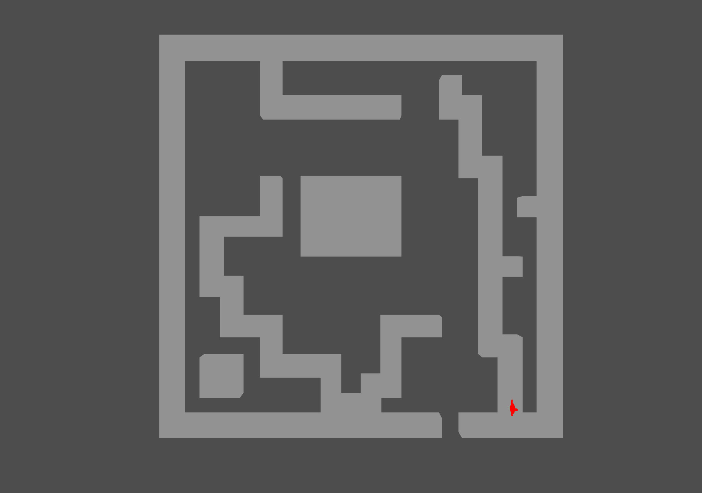

# ImageMaze

This demo reads a PNG and draws every non-white pixel as a coloured cube. The
white pixels become the paths through the maze and the red troll can only move
onto those pixels.

There are OpenGL and WebGPU versions. They share the image coordinates,
collision tests and actor state in `maze_scene.py`, so both versions behave in
the same way.



## Running

```bash
uv run --script main.py
uv run --script main_webgpu.py
```

The original `small.png` map is used by default. The other two maps from the
C++ demo can be selected from the command line.

```bash
uv run --script main.py --map maps/colour.png
uv run --script main_webgpu.py --map maps/test.png
```

## Controls

- Arrow keys move the troll through white pixels.
- `1` selects the overhead camera.
- `2` selects the troll camera.
- `W` toggles the maze wireframe.
- Left-drag rotates, right-drag pans and the wheel zooms.
- Space resets the mouse transform.
- Escape quits.

The WebGPU wireframe is built from explicit cube edges. This avoids depending
on the optional WebGPU polygon-line feature whilst keeping the same control as
the OpenGL version.
