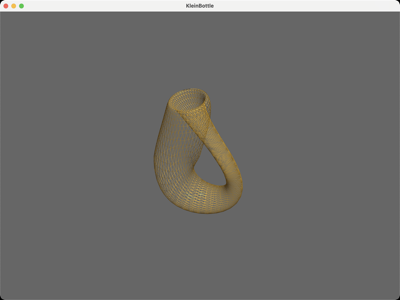

# KleinBottle

Procedurally generates a Klein bottle mesh from Paul Bourke's parametric
equations (40x40 resolution) and shades it with a gold Phong material,
starting in wireframe mode.

## Controls

- `w` : wireframe.
- `s` : solid fill.
- `Left-drag` : orbit.
- `Right-drag` : pan.
- `Wheel` : zoom.
- `space` : reset.

## References

- [Klein bottle (Paul Bourke)](https://paulbourke.net/geometry/klein/) — the parametric equations this mesh is generated from.
- [Klein bottle — Wikipedia](https://en.wikipedia.org/wiki/Klein_bottle) — background on the non-orientable surface (and why lighting a surface with no inside is fun).
