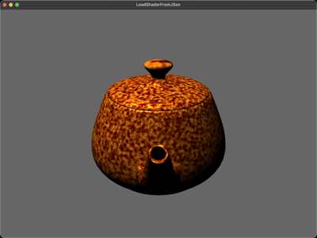

# LoadShaderFromJSon

A shader program assembled at runtime from files listed in a JSON manifest
(`shaders/shaders.json`), rather than one hardcoded vertex/fragment path
pair. Each stage in the manifest is a list of GLSL files concatenated in
order, which is how `common.glsl` (the `Materials`/`Lights` structs and the
`light`/`material`/`time`/`repeat` uniforms) and `noise3D.glsl` (Ashima
Arts' `snoise`) get shared between the vertex and fragment stages without
copy-pasting them. `load_shader_from_json()` in `main.py` drives
`ShaderLib`'s low-level per-stage API directly, since `load_shader()` only
takes a single file per stage.

The teapot is lit with a standard Phong pass, but its surface colour comes
from six octaves of 3D simplex noise summed together -- a fractal sum that
gives the gold material a mottled, marble-like look shifting continuously
as `time` advances.

## Controls
- `w` / `s` : wireframe / fill
- `f` / `n` : fullscreen / windowed
- `1` / `2` : decrease / increase the noise UV scale (`repeat`)
- Left-drag : orbit, Right-drag : pan, Wheel : zoom
- `Esc` : quit

## WebGPU version

`main_webgpu.py` reinterprets the JSON-driven shader assembly for WGSL's
shape: wgpu-py has no native "load a shader program from JSON" path (a
WGSL module is one source string with both vertex and fragment entry
points, unlike GLSL's separate compiled stages), so `shaders_webgpu/shaders.json`
lists WGSL fragment files that get concatenated into one module source
before `device.create_shader_module` -- same "assemble a shader from
JSON-declared files" lesson, applied to WebGPU's single-module shape. One
intentional smoothing: the OpenGL version's `repeat` uniform has a visible
jump on the first `1`/`2` keypress, an artifact of the C++ source setting
its initial value in two disconnected places; this version starts `repeat`
at `0.1` cleanly since there's no equivalent second initialization site here.
