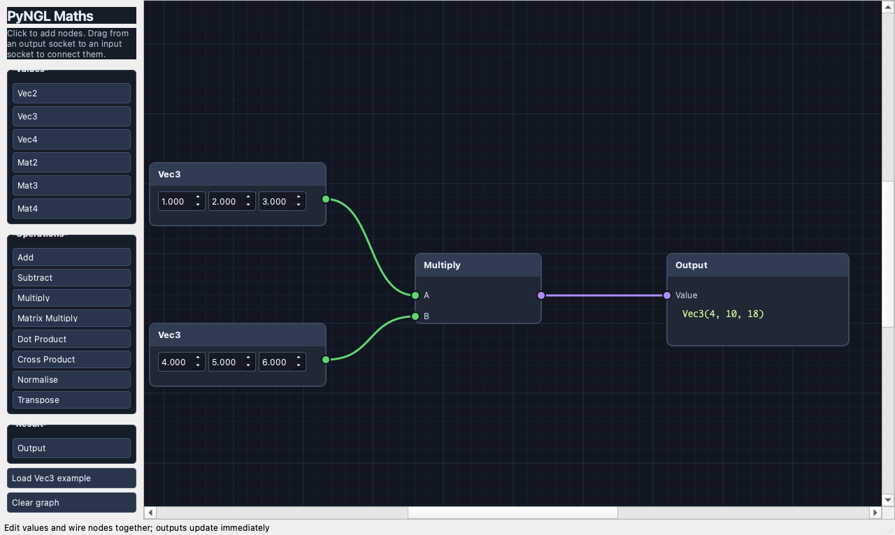

# MathNodeEditor



This is a small PySide6 node editor for experimenting with the PyNGL maths classes. It starts with two editable `Vec3` nodes wired through a component multiply node, so changing any value updates the output straight away.

The value palette has `Float`, `Vec2`, `Vec3`, `Vec4`, `Mat2`, `Mat3`, `Mat4` and `Quaternion`. Quaternions use the same `(s, x, y, z)` order as PyNGL and start as the identity quaternion.

The Mat4 nodes cover translate, scale, rotation about each axis, `look_at`, perspective, orthographic and frustum projection. The quaternion nodes cover axis-angle creation, Hamilton product, vector rotation, conversion to and from `Mat4`, slerp, conjugate and inverse. The original add, subtract, component multiply, matrix multiply, dot, cross, normalise and transpose nodes are still present.

`Multiply` is explicitly component-wise (PyNGL reserves `*` for scalar multiplication), whilst `Matrix Multiply` and `Quaternion Product` use the normal `@` operation.

Click a palette button to add a node, or move the pointer over the canvas and press `Tab` to open the node menu at that position. Start typing to filter the menu and press `Return` to create the first matching node. You can also select an entry with the mouse.

Drag from an output socket to an input socket to connect it. Value nodes use zero vectors and identity matrices as their defaults. The palette scrolls, the mouse wheel zooms the canvas (clamped to sensible limits) and nodes can be selected and dragged around. Press `H` to frame every node in the view.

Select a node or wire and press `Delete`/`Backspace` to remove it, or right-click it for the same option. The `Save graph...`/`Load graph...` buttons write the current graph out as JSON and read it back in.

## Running it

```bash
uv run MathNodeEditor/main.py
uv run pytest MathNodeEditor/tests
```
