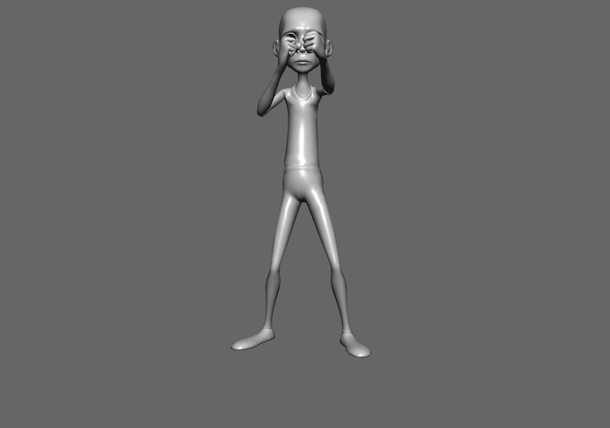

# MorphObj

This demo blends three matching OBJ poses in the vertex shader. Pose one is the
base mesh; the other two are stored as position and normal offsets, so each
vertex carries the base data plus two deltas.



The OpenGL and WebGPU versions load the same Bruce Lee OBJ files and use the
same packed numpy data from `morph_mesh.py`.

## Running

```bash
uv run --script main.py
uv run --script main_webgpu.py
```

## Controls

- `Q` / `W` decrease or increase pose one.
- `A` / `S` decrease or increase pose two.
- `Z` and `X` play the two short punch animations.
- Space pauses and resumes the punch timers.
- Left-drag rotates, right-drag pans and the wheel zooms.
- `F` / `N` switch between full-screen and windowed modes.
- Escape quits.
