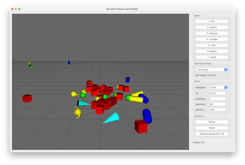

# MuJoCo Physics and PyNGL



A PyNGL / PySide6 port of the C++ [BulletNGL](https://github.com/NCCA/BulletNGL)
demo I use in the lectures, with [MuJoCo](https://mujoco.readthedocs.io/) doing
the physics instead of Bullet. Press the number keys, watch things fall on a
ground plane, same as the original. What makes it worth porting is that MuJoCo
will not let you do the one thing the Bullet demo is built around, so the port
has to solve a problem the original never had.

To run it:

```bash
cd MuJoCoNGL
uv run main.py
```

| key      | what it does                                                    |
| -------- | --------------------------------------------------------------- |
| `1`-`7`  | drop a box, sphere, capsule, cylinder, cone, teapot or apple     |
| arrows   | shove everything left, right, up or down                         |
| `space`  | pause and resume                                                 |
| `x`      | single step whilst paused                                        |
| `r`      | random placement on and off                                      |
| `0`      | reset                                                            |
| `w`/`s`  | wireframe on and off                                             |
| `f`/`n`  | fullscreen and windowed                                          |

Left mouse rotates, right mouse pans, the wheel zooms. The panel on the right
carries the things MuJoCo has and Bullet does not, and I have left everything
that was on a key in the C++ on a key here.

## Bullet lets you add a body, MuJoCo does not

In Bullet you build a world and then hand it a `btRigidBody` whenever you feel
like it, which is exactly what `NGLScene::addCube` does when you press `1`.
MuJoCo does not work like that. You describe a model, compile it into an
`mjModel`, and from then on the model is fixed. There is no `addBody`. The
number keys in this demo have to get round that, and there are two reasonable
ways to do it, so both are here and the dropdown switches between them whilst
it is running.

**Recompile** keeps a live [`MjSpec`](https://mujoco.readthedocs.io/en/stable/programming/modeledit.html),
appends a body to it, and calls `spec.recompile(model, data)`. That hands back a
new model and data with the state of the existing bodies mapped across, so the
pile already on the floor does not so much as twitch. It reads almost exactly
like the Bullet original and it is the idiomatic MuJoCo 3.x answer, but every
key press pays for a model compile -- a few milliseconds here, and growing with
the size of the model.

**Pool** compiles every body it will ever need up front, parks them out of the
way, and "spawns" one by teleporting it into place. Nothing is ever recompiled
so spawning costs almost nothing, but the number of bodies is capped and the
model is a good deal harder to read.

The panel prints how long the last spawn took, which is the whole reason both
are in here: with 24 bodies in play a recompile is around 3 ms and a pool spawn
around 0.5 ms. Neither is a wrong answer, they just fail in different
directions, and it is a better lesson felt than described.

## Things worth knowing if you try this yourself

These are the ones that cost me time.

**MuJoCo has no up axis.** It is usually described as Z-up but that is only a
convention of the examples -- the solver only ever sees `option.gravity`. Point
gravity down -Y, rotate the ground plane's normal from +Z to +Y with a
quaternion, and the whole demo lives in NGL's Y-up world with no conversion
layer anywhere.

**Parking a body under the ground does not work.** A MuJoCo plane is an infinite
half-space, so anything below it is deeply penetrating it, and the solver fires
it back out the moment you switch collisions on. The pool parks bodies *above*
the ground instead.

**`body_gravcomp` is quietly ignored unless you ask for it at compile time.**
Gravity compensation is what keeps the pool's parked bodies from falling, and
it can be written at runtime -- except MuJoCo counts the bodies using it when it
compiles, and skips the calculation entirely when that count is zero. So writing
`model.body_gravcomp[i] = 1.0` to a model that was compiled without any does
nothing at all, no error, and your parked bodies slide away. Setting it in the
spec is what makes the runtime toggle work, and `model.ngravcomp > 0` is the
thing to assert.

**MuJoCo moves your mesh.** On compile it shifts the vertices into the mesh's
principal inertia frame, so `mesh_pos` and `mesh_quat` come back as a real
translation *and* a real rotation. Draw the original OBJ straight at the body
transform and the visible teapot sits at an angle to the hull that is actually
colliding, which looks convincingly like a physics bug. A vertex of the file
relates to the stored one by `original = R @ stored + p`, so the drawing has to
fold the inverse in ahead of the body transform.

**There is no cone geom.** The primitive list stops at plane, sphere, capsule,
ellipsoid, cylinder, box and mesh, so the cone goes in as a mesh. It is convex,
which is what MuJoCo wants anyway.

## How it works

The collision meshes go in the way the C++ ones did. There the demo walked
`ngl::Obj::getVertexList()` calling `btConvexHullShape::addPoint` on every
vertex; here PyNGL's `Obj` reads the same low-res file and the points go to
MuJoCo, which computes the hull itself at compile time. The high-res OBJ is
still what gets drawn, so the teapot you see is not the teapot that collides.

- `collision_shapes.py` -- the shape catalogue, the `CollisionShape` singleton's
  opposite number. Sizes, colours, and how to write each geom into a spec.
- `physics_world.py` -- the `PhysicsWorld` facade and the two strategies behind
  it. No Qt, no OpenGL.
- `scene.py` -- the drawing. It asks the world for a shape name and a `Mat4` per
  body and knows nothing about MuJoCo.
- `main.py` -- the window, the panel and the key bindings.

Because the physics has no Qt or OpenGL in it the tests are headless and check
the simulation rather than the pixels: that gravity really does pull along -Y
and not -Z, that recompiling leaves the existing bodies untouched, that parked
pool bodies stay parked, that both strategies land the same box in the same
place, and that the mesh correction reproduces the original vertices.

```bash
uv run pytest MuJoCoNGL/tests/
```

## References

The original demo, which this is a port of:

- [NCCA/BulletNGL](https://github.com/NCCA/BulletNGL) -- the C++ NGL version,
  pulled in as a submodule of [NCCA/NGL9Demos](https://github.com/NCCA/NGL9Demos).
- [Bullet](https://pybullet.org/wordpress/) -- the physics engine it uses.

MuJoCo:

- [MuJoCo documentation](https://mujoco.readthedocs.io/) -- start at
  [Overview](https://mujoco.readthedocs.io/en/stable/overview.html), and
  [Computation](https://mujoco.readthedocs.io/en/stable/computation/index.html)
  for what the solver is actually doing.
- [Model editing](https://mujoco.readthedocs.io/en/stable/programming/modeledit.html)
  -- `MjSpec` and `recompile`, which the whole recompile strategy rests on.
- [MJCF reference](https://mujoco.readthedocs.io/en/stable/XMLreference.html) --
  the geom types, and `gravcomp` on a body.
- [google-deepmind/mujoco](https://github.com/google-deepmind/mujoco) and the
  [mujoco](https://pypi.org/project/mujoco/) package on PyPI.

Background, if the solver rather than the API is what you are after:

- [Todorov, Erez and Tassa, *MuJoCo: A physics engine for model-based control*](https://homes.cs.washington.edu/~todorov/papers/TodorovIROS12.pdf)
  -- the original paper, and the clearest statement of why it is built the way
  it is.
- [Convex hull](https://en.wikipedia.org/wiki/Convex_hull) -- what both engines
  are doing to those collision meshes.
- [Collision detection](https://mujoco.readthedocs.io/en/stable/computation/index.html#collision)
  -- MuJoCo's narrow phase, and why the hull vertex cap matters.
