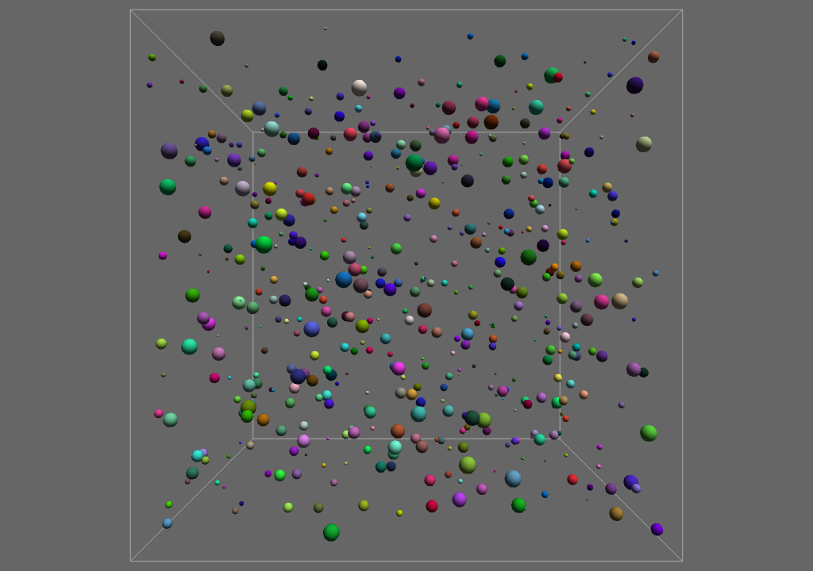

# OctreeAbstract

This is the abstract octree particle-collision demo from NGL9Demos. The perfect
octree and sphere collision rules are plain Python in `octree.py`; OpenGL and
WebGPU only handle the drawing.



Every sphere is inserted into each leaf it overlaps. Candidate pairs are then
collected from the leaves and de-duplicated before the narrow-phase sphere test.
Both renderers draw all particles with one instanced sphere call.

## Running

```bash
uv run --script main.py
uv run --script main_webgpu.py
```

The default 10 by 10 by 10 grid gives 1000 particles. The original C++ setup
used 8000, which can still be selected when comparing the implementations.

```bash
uv run --script main.py --grid 20
uv run --script main_webgpu.py --grid 20
```

## Controls

- `A` pauses and resumes the simulation.
- Space rebuilds the seeded particle grid.
- Left-drag rotates, right-drag pans and the wheel zooms.
- `W` / `S` select wireframe or filled spheres in the OpenGL version.
- Escape quits.
