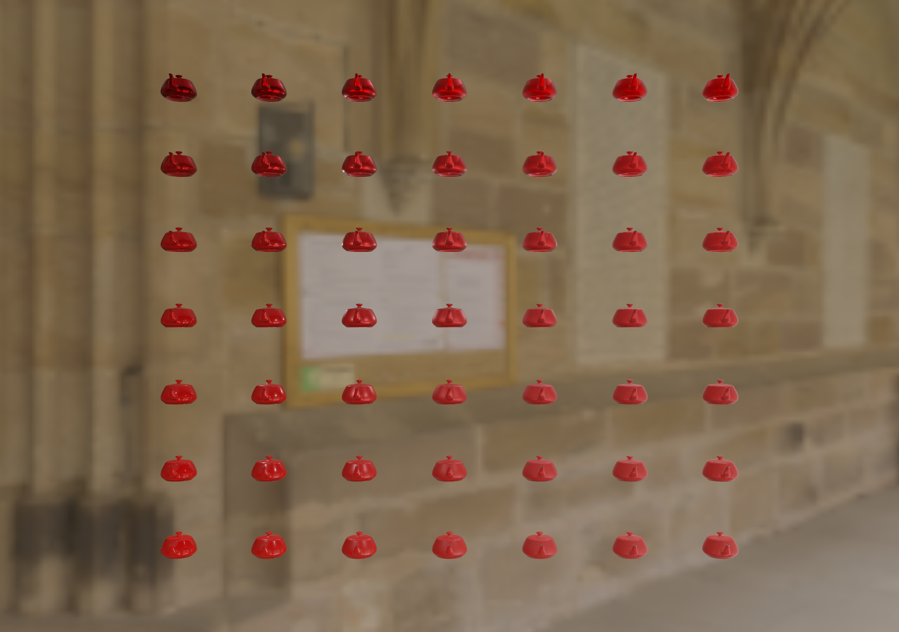

# HDRI — Image Based Lighting




This is the full version of [`PBR/IBL`](../IBL). That demo lit its sphere
grid from a procedural sky, was OpenGL-only, and cut the prefiltered
specular mip chain (roughness didn't actually blur the reflection). This
one lights a 7×7 teapot grid — metallic sweeping down the rows, roughness
across the columns — from a real HDR panorama
(`images/historic_cloister_passage_1k.exr`), bakes the whole split-sum IBL
chain on the GPU by rendering to a cubemap, and runs on both OpenGL and
WebGPU. You can see the difference in the screenshots above: the left
column stays a sharp mirror, the right column visibly loses the reflected
stonework as roughness climbs.

## The bake

Everything is baked once at startup, straight to the GPU, no numpy
precompute this time:

| Stage | Size | What it does |
| --- | --- | --- |
| Equirectangular → cubemap | 512² × 6 faces | reprojects the `.exr` panorama onto a cube so it can be sampled/convolved as an environment |
| Irradiance convolution | 32² × 6 faces | cosine-weighted hemisphere integral per texel — the diffuse ambient term |
| Prefiltered specular chain | 128² × 6 faces, 5 mips | GGX importance-sampled per roughness level, one mip per roughness band |
| BRDF LUT | 512² | Karis's split-sum `A`/`B` scale-and-bias table, same for every scene |

## The split-sum ambient term

```
ambient = kD * irradiance(N) * albedo
        + prefilteredColour(R, roughness) * (F * A + B)
```

`irradiance(N)` and `prefilteredColour` come from the two baked cubemaps
above, sampled with `textureLod`/`textureSampleLevel` against the mip that
matches the surface roughness; `A` and `B` come from the BRDF LUT, indexed
by `(N·V, roughness)`.

## Controls

| Key | OpenGL (`main.py`) | WebGPU (`HDRIWebGPU.py`) |
| --- | --- | --- |
| LMB drag | rotate | rotate |
| RMB drag | pan | — |
| Wheel | zoom | zoom |
| Arrow keys | — | fly camera: up/down forward-back, left/right strafe |
| `I` | toggle IBL ambient on/off | toggle IBL ambient on/off |
| `E` | cycle env / irradiance / prefilter debug view | cycle env / irradiance / prefilter debug view |
| Space | reset camera | reset camera |
| Esc | quit | quit |

## Running it

```bash
uv run PBR/HDRI/main.py         # OpenGL
uv run PBR/HDRI/HDRIWebGPU.py   # WebGPU
```

Reading the `.exr` needs [OpenEXR](https://pypi.org/project/OpenEXR/),
already a project dependency (`PBR/HDRI/exr_loader.py`).

## References

- LearnOpenGL — [Diffuse Irradiance](https://learnopengl.com/PBR/IBL/Diffuse-irradiance)
  and [Specular IBL](https://learnopengl.com/PBR/IBL/Specular-IBL) — the
  derivations both bake stages and the shader ambient term are ported from.
- B. Karis, "Real Shading in Unreal Engine 4", SIGGRAPH 2013 course notes —
  [course page](https://blog.selfshadow.com/publications/s2013-shading-course/)
  — the split-sum approximation this demo implements in full.
- [`PBR/IBL`](../IBL) — the cut-down, procedural-sky, OpenGL-only version
  this demo completes.
- [`PBR/SimplePBR`](../SimplePBR) — the direct-lighting Cook-Torrance shader
  both IBL demos extend with an ambient term.
