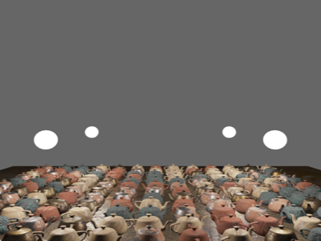

# PBRTexture


This demo shows how to render using Physically Based Rendering (PBR) techniques as outlined in https://learnopengl.com/PBR/Lighting

In particular this demo uses a class called texture_pack which can read in a json file containing a list of textures and locations for easy texture management.

```bash
uv run main.py
```

## WebGPU version



`PBRTextureWebGPU.py` renders the same scene with wgpu-py instead of OpenGL, reusing the same `textures/` and `textures.json`. Whilst I mainly use WebGPU for my teaching now I wanted a side-by-side with the OpenGL demo so the difference in how textures are handled is obvious.

```bash
uv run PBRTextureWebGPU.py
```

The interesting part is `texture_pack_webgpu.py`. OpenGL binds the five maps (albedo, normal, metallic, roughness, AO) to global texture units and re-binds all five before every draw with `glActiveTexture`. WebGPU has no global texture-unit state — resources reach the shader through bind groups — so each material loads its maps into their own `GPUTexture` and bakes a single `GPUBindGroup` up front. Selecting a material at draw time is then one `set_bind_group` call rather than five rebinds.

The rest follows the WebGPU idioms: an explicit three-group layout (per-object transforms in `@group(0)`, lights and camera in `@group(1)`, the material pack in `@group(2)`), and a dynamic-offset uniform buffer with one padded slot per teapot so the whole grid draws in a single render pass. The shader `PBRTexture.wgsl` is a straight port of the GLSL, with `dpdx`/`dpdy` standing in for `dFdx`/`dFdy` in the tangent-space normal mapping.

Controls are the same as the OpenGL demo: arrow keys move the camera, left mouse rotates, the wheel zooms, `1`–`4` toggle the lights, `L` toggles the light spheres, `R` reseeds the layout and `Space` resets the camera.

## Future work

The WebGPU version keeps close to the OpenGL structure rather than chasing performance, so there is room to improve:

- The greyscale metallic/roughness/AO maps are uploaded as full RGBA, which wastes three quarters of the memory. Loading them as `r8unorm` and sampling `.r` would be leaner.
- Textures are uploaded with a single mip level, so distant teapots alias a little. The OpenGL demo generates mipmaps; WebGPU has no `glGenerateMipmap`, so this needs a small blit chain to fill the mip levels.
- Every teapot gets its own bind group and a per-frame uniform write. Instanced drawing, or a storage buffer of per-instance transforms indexed by `instance_index`, would cut the draw and upload cost.

## References

- [LearnOpenGL — PBR Theory](https://learnopengl.com/PBR/Theory) and [PBR Lighting](https://learnopengl.com/PBR/Lighting) — the textured metallic/roughness workflow implemented here.
- R. L. Cook & K. E. Torrance, "A Reflectance Model for Computer Graphics", ACM TOG 1982 — [ACM](https://dl.acm.org/doi/10.1145/357290.357293) — the microfacet BRDF underlying modern PBR.
- B. Karis, "Real Shading in Unreal Engine 4", SIGGRAPH 2013 course — [course page](https://blog.selfshadow.com/publications/s2013-shading-course/) — the GGX/Smith/Schlick term choices most real-time PBR follows.
- [FreePBR](https://freepbr.com/) — source of the albedo/normal/metallic/roughness/AO texture sets.
