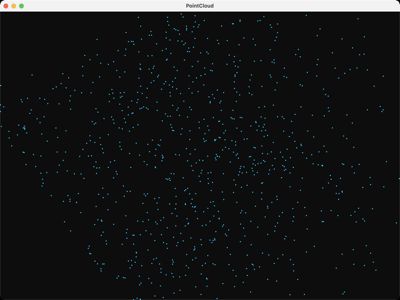

# PointCloud

Loads a plain XYZ point cloud (1000 random points), computes its bounding
box and a Ritter approximate bounding sphere, unitizes it to fit the view,
and renders it as `GL_POINTS`.

## Controls

`+`/`-` : grow/shrink point size
Left-drag : orbit, Right-drag : pan, Wheel : zoom, `space` : reset

## References

- J. Ritter, "An Efficient Bounding Sphere", _Graphics Gems_, 1990 — [ACM](https://dl.acm.org/doi/10.5555/90767.90836), [original C code](https://github.com/erich666/GraphicsGems/blob/master/gems/BoundSphere.c) the approximate bounding-sphere algorithm used here.
- [Bounding sphere — Wikipedia](https://en.wikipedia.org/wiki/Bounding_sphere) — Ritter's algorithm vs exact (Welzl) methods.
