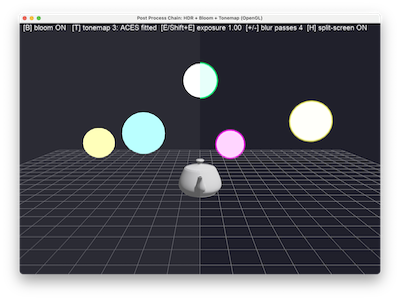

# Post Process Chain



_TODO(Jon): capture a screenshot of the demo running (with bloom on and the split-screen `H` toggle enabled looks best) and save it as `PostProcessChain.png` in this folder._

A real multi-FBO HDR post-processing chain: bright pass, separable Gaussian bloom, and three swappable tonemap operators, built on the same FBO/full-screen-triangle machinery as `OITransparency`. A grid, a teapot and five emissive spheres with HDR colour values (components deliberately > 1.0, e.g. `(8, 4, 0.5)`) are rendered into a floating-point framebuffer, then a four-pass chain turns that HDR image into something an 8-bit display can show without every bright highlight clipping to flat white.

## Controls

| Key | Action |
| :-- | :-- |
| `B` | toggle bloom on/off |
| `T` | cycle tonemap operator: none (clamp) -> Reinhard -> ACES fitted |
| `E` / `Shift+E` | increase / decrease exposure |
| `+` / `-` | more / fewer blur passes (1..8) |
| `H` | toggle split-screen: left half raw clamp, right half the full chain |
| LMB / RMB / wheel | rotate / pan / zoom, `Space` resets, `Esc` quits |

## The chain

1. **Scene -> full-res `RGBA16F` FBO.** The grid is drawn with the ordinary `DefaultShader.COLOUR`. The teapot and five spheres go through a small custom shader (`SceneVertex`/`SceneFragment.glsl`) with an `emissive` uniform: the teapot gets plain N·L Lambert shading (never exceeding 1.0), the spheres output their `Colour` uniform verbatim — and those colours have components as high as 9.0. Nothing here clamps or gamma-corrects; that is the whole point of rendering into a floating-point target.
2. **Bright pass -> half-res `RGBA16F` FBO.** `BrightPassFragment.glsl` samples the full-res scene texture (`LINEAR` filtering, so this doubles as a cheap downsample) and keeps `max(colour - threshold, 0)` — everything below the threshold contributes nothing, so ordinary lit geometry never blooms, only the emissive spheres do.
3. **Separable Gaussian blur.** `BlurFragment.glsl` is a fixed 5-tap 1-D kernel; `main.py` ping-pongs it between two half-res FBOs (`blur_a`, `blur_b`) for `n_passes` iterations (`+`/`-`), each iteration doing one horizontal draw (bright/blur_b -> blur_a) followed by one vertical draw (blur_a -> blur_b). Two draws instead of one 2-D kernel is the standard trick that turns an `O(n^2)` blur into `O(2n)`.
4. **Tonemap composite -> screen.** `TonemapFragment.glsl` adds `bloomStrength * bloom` (the half-res blur result, upsampled by `LINEAR` sampling) back onto the full-res scene, multiplies by `exposure`, then applies one of three operators, then gamma 2.2:
   - **none** — `clamp(colour, 0, 1)`, the naive behaviour every 8-bit framebuffer would give you for free (and exactly what left-of-screen shows when `H` is on)
   - **Reinhard** — `c / (1 + c)`, a cheap curve that compresses the whole range but crushes contrast at the top end
   - **ACES fitted** — the Narkowicz 2015 fitted approximation to the ACES filmic curve, noticeably better highlight roll-off for the same input

## Why HDR before tonemap

If the emissive spheres were shaded straight into an ordinary 8-bit framebuffer, "bright" and "extremely bright" would both just be `(1,1,1)` white the instant they were written — there would be nothing left for a bright-pass threshold to find, and no way to later choose how the highlights roll off. Rendering into `RGBA16F` first lets values like `(9, 9, 2)` survive unclipped all the way to the final pass, where the tonemap operator makes an *explicit, swappable* choice (`T`) about how to compress that unbounded range back into `[0,1]` — instead of an implicit, irreversible one made the moment a fragment shader returns.

## `H`: split screen

The tonemap fragment shader branches on `gl_FragCoord.x` against half the screen width: the left half runs `clamp(scene, 0, 1)` with no bloom, no exposure and no operator — i.e. what you'd see without any of this pipeline — and the right half runs the full chain. It is the fastest way to see that the whole exercise is doing something, not just adding a soft-focus filter.

## Curve maths worth testing

`tonemap_maths.py` is a numpy-only module (no GL/Qt) holding the Reinhard and ACES-fitted curves used by `TonemapFragment.glsl` — the GLSL hardcodes the same coefficients (see the comments next to `reinhard()`/`acesFitted()` in the shader) so a drift between the shader and this reference would show up as a shader visibly disagreeing with `tests/test_tonemap_maths.py`, not silently. Tests cover: both curves map `0 -> 0`, are monotonic, and never exceed `1.0` for large input.

```bash
uv run pytest PostProcessChain/tests
```

## References

- N. Narkowicz, "ACES Filmic Tone Mapping Curve", 2016 — [blog post](https://knarkowicz.wordpress.com/2016/01/06/aces-filmic-tone-mapping-curve/) — the fitted ACES approximation used by the `ACES fitted` operator.
- E. Reinhard, M. Stark, P. Shirley & J. Ferwerda, "Photographic Tone Reproduction for Digital Images", SIGGRAPH 2002 — [PDF](https://www.cs.utah.edu/~reinhard/cdrom/tonemap.pdf) — the `c/(1+c)` operator.
- [LearnOpenGL — Bloom](https://learnopengl.com/Advanced-Lighting/Bloom) and [LearnOpenGL — HDR](https://learnopengl.com/Advanced-Lighting/HDR) — the bright-pass/separable-blur/tonemap structure this demo follows.
- [Filmic Worlds — Filmic Tonemapping Operators](http://filmicworlds.com/blog/filmic-tonemapping-operators/) — a survey of tonemap curves and why "none" clips so badly.
