# Py-NGL Demos

This repository contains a collection of examples for the PyNGL library and used in teaching across a number of NCCA courses.

It is expected you will use uv to run all the python applications. The [RunDemos.py](RunDemos.py) will launch all the demos in the repository.

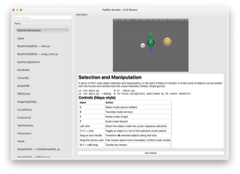

There are two main types of demos in this repository:

- **OpenGL Demos**: These are demos that use Modern core profile OpenGL for rendering.
- **WebGPU Demos**: These are demos that use WebGPU for rendering and in a number of cases are also available as OpenGL demos.

You can see the Source for the [PyNGL](https://github.com/NCCA/PyNGL) on GitHub and it can be installed via [PyPi](https://pypi.org/project/ncca-ngl/) Full details of PyNGL and how to use it can be found at [https://ncca.github.io/PyNGL/](https://ncca.github.io/PyNGL/)

Each demo lives in its own folder with a `README.md` explaining it. Click a preview or demo name below to open that folder.

To quickly run all the demos use the [smoketest_all.py](smoketest_all.py) script which will launch all the demos for a few seconds and then exit, useful for quickly verifying that all demos are working.

## Contents

- [Getting Started / Templates](#getting-started--templates)
- [OpenGL Fundamentals](#opengl-fundamentals)
- [Vertex Array Objects](#vertex-array-objects)
- [Instancing & Performance](#instancing--performance)
- [Geometry & Meshes](#geometry--meshes)
- [Transforms & Hierarchy](#transforms--hierarchy)
- [Animation](#animation)
- [Textures & Materials](#textures--materials)
- [Blending & Transparency](#blending--transparency)
- [Environment & Sky](#environment--sky)
- [Curves & Interpolation](#curves--interpolation)
- [Selection & Picking](#selection--picking)
- [Collision Detection](#collision-detection)
- [Framebuffers & Post Processing](#framebuffers--post-processing)
- [Lighting & Shadows](#lighting--shadows)
- [Ray Marching](#ray-marching)
- [Geometry & Tessellation Shaders](#geometry--tessellation-shaders)
- [Uniforms & Buffers](#uniforms--buffers)
- [Compute Shaders](#compute-shaders)
- [WebGPU](#webgpu)
- [Particles & Points](#particles--points)
- [GUI](#gui)

## Getting Started / Templates

|                                         Preview                                          | Demo                               | Description                                  |
| :--------------------------------------------------------------------------------------: | :--------------------------------- | :------------------------------------------- |
| <a href="BlankPySide6NGL">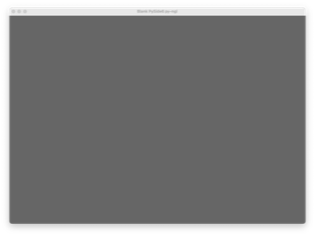</a> | [BlankPySide6NGL](BlankPySide6NGL) | Minimal PySide6 + NGL OpenGL window template |
|      <a href="BlankPySDL3">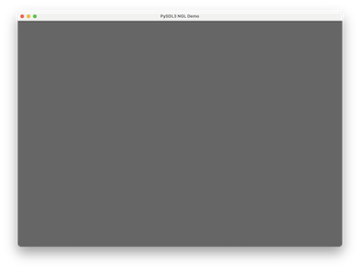</a>       | [BlankPySDL3](BlankPySDL3)         | Minimal PySDL3 + NGL OpenGL window template  |
|      <a href="BlankWebGPU">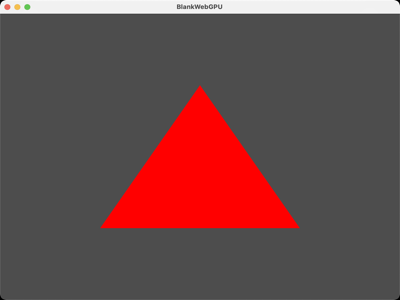</a>       | [BlankWebGPU](BlankWebGPU)         | Minimal WebGPU window template               |
|     <a href="SimplePyNGL">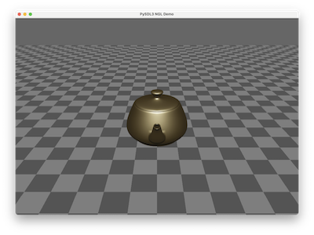</a>      | [SimplePyNGL](SimplePyNGL)         | Simple first PyNGL examples                  |
|      <a href="SimpleWebGPU">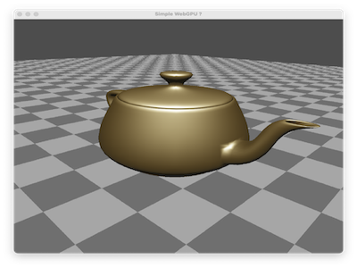</a>       | [SimpleWebGPU](SimpleWebGPU)       | Simple first WebGPU example                  |

## OpenGL Fundamentals

|                                          Preview                                          | Demo                                   | Description                        |
| :---------------------------------------------------------------------------------------: | :------------------------------------- | :--------------------------------- |
|       <a href="2DDrawingOpenGL">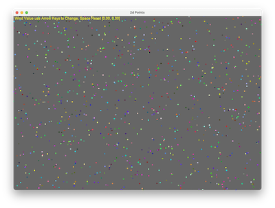</a>        | [2DDrawingOpenGL](2DDrawingOpenGL)     | 2D drawing with OpenGL             |
|              <a href="Camera">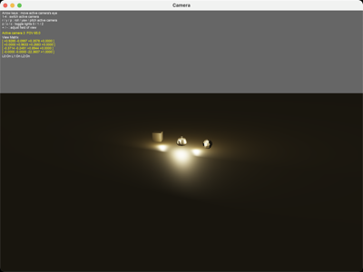</a>               | [Camera](Camera)                       | Camera / view and projection setup |
|              <a href="Lights">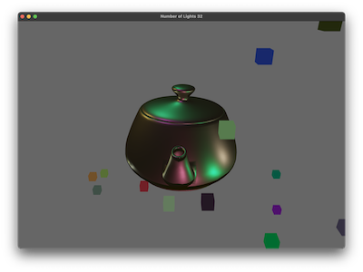</a>               | [Lights](Lights)                       | Basic lighting                     |
|    <a href="ShadingModels">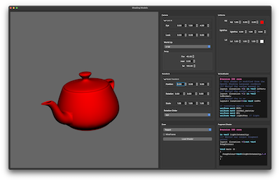</a>    | [ShadingModels](ShadingModels)         | Comparison of shading models       |
|          <a href="ScreenTri">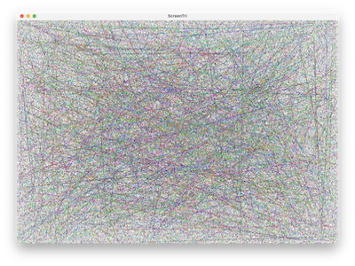</a>          | [ScreenTri](ScreenTri)                 | Full-screen triangle technique     |
| <a href="OpenGLPrimRestart">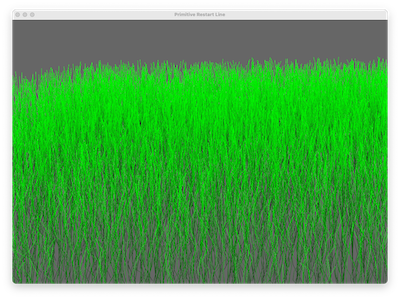</a> | [OpenGLPrimRestart](OpenGLPrimRestart) | Primitive restart index            |
|       <a href="FrustumCull">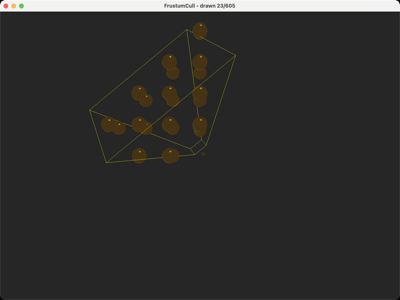</a>       | [FrustumCull](FrustumCull)             | View frustum culling               |
|     <a href="FontRendering">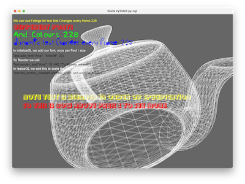</a>      | [FontRendering](FontRendering)         | Text / font rendering              |

## Vertex Array Objects

|                                                                 Preview                                                                 | Demo                                                                                 | Description                   |
| :-------------------------------------------------------------------------------------------------------------------------------------: | :----------------------------------------------------------------------------------- | :---------------------------- |
|                           <a href="VAOPrimitives">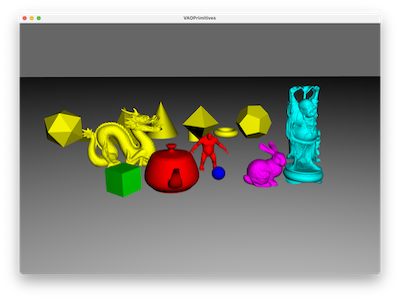</a>                           | [VAOPrimitives](VAOPrimitives)                                                       | Built-in VAO primitives       |
|                   <a href="VertexArrayObject/Sphere">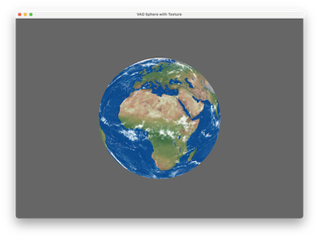</a>                    | [VertexArrayObject/Sphere](VertexArrayObject/Sphere)                                 | Generating a sphere VAO       |
|                                             | [VertexArrayObject/Boid](VertexArrayObject/Boid)                                     | Simple Boid VAO               |
|                           | [VertexArrayObject/BoidShaded](VertexArrayObject/BoidShaded)                         | Shaded Boid VAO               |
|            <a href="VertexArrayObject/ChangingVAO">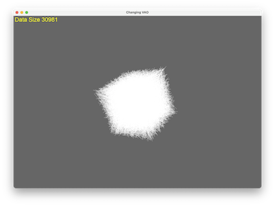</a>            | [VertexArrayObject/ChangingVAO](VertexArrayObject/ChangingVAO)                       | Updating VAO data             |
| <a href="VertexArrayObject/ChangingVAOMultiBuffer">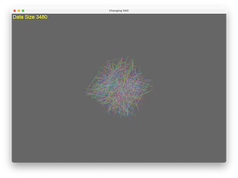</a> | [VertexArrayObject/ChangingVAOMultiBuffer](VertexArrayObject/ChangingVAOMultiBuffer) | Updating a multi-buffer VAO   |
|           <a href="VertexArrayObject/MultiBufferVAO">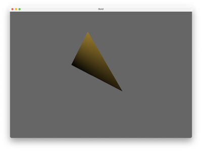</a>            | [VertexArrayObject/MultiBufferVAO](VertexArrayObject/MultiBufferVAO)                 | Multi-buffer VAO              |
|   <a href="VertexArrayObject/SimpleIndexVAOFactory">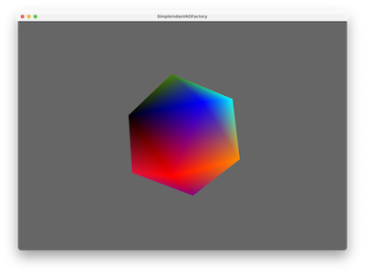</a>    | [VertexArrayObject/SimpleIndexVAOFactory](VertexArrayObject/SimpleIndexVAOFactory)   | Indexed VAO factory           |
|     <a href="VertexArrayObject/ExtendedVAOFactory">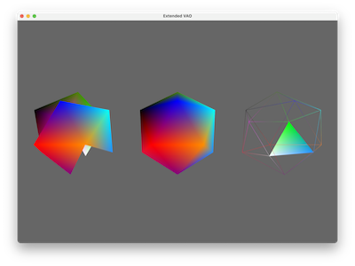</a>     | [VertexArrayObject/ExtendedVAOFactory](VertexArrayObject/ExtendedVAOFactory)         | Custom / extended VAO factory |

## Instancing & Performance

|                                  Preview                                   | Demo                     | Description                                                                                   |
| :------------------------------------------------------------------------: | :----------------------- | :-------------------------------------------------------------------------------------------- |
| <a href="Instancing">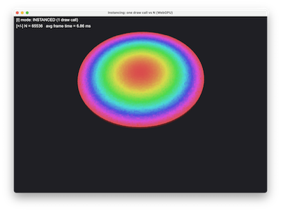</a> | [Instancing](Instancing) | GPU instancing vs a Python draw-call loop, with an on-screen frame-time HUD (OpenGL + WebGPU) |

## Geometry & Meshes

|                                       Preview                                       | Demo                           | Description                                                                  |
| :---------------------------------------------------------------------------------: | :----------------------------- | :--------------------------------------------------------------------------- |
|        <a href="ObjViewer">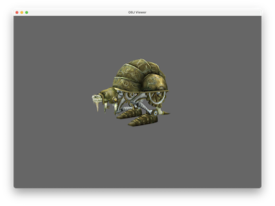</a>        | [ObjViewer](ObjViewer)         | Load and view Obj meshes                                                     |
|       <a href="ColourObj">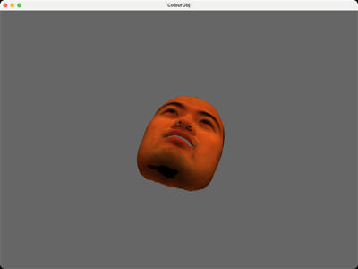</a>       | [ColourObj](ColourObj)         | Obj mesh with per-vertex colour                                              |
|       <a href="Obj2Numpy">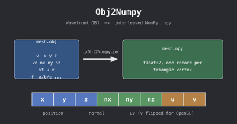</a>       | [Obj2Numpy](Obj2Numpy)         | Convert Obj data to NumPy arrays                                             |
|        | [KleinBottle](KleinBottle)     | Procedural Klein bottle                                                      |
| <a href="MarchingCubes">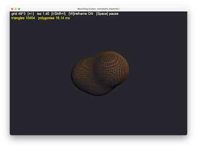</a> | [MarchingCubes](MarchingCubes) | Metaballs polygonised into a mesh every frame with vectorised Marching Cubes |

## Transforms & Hierarchy

|                                          Preview                                          | Demo                                       | Description                                                                       |
| :----------------------------------------------------------------------------------------: | :------------------------------------------ | :--------------------------------------------------------------------------------- |
| <a href="SceneGraph">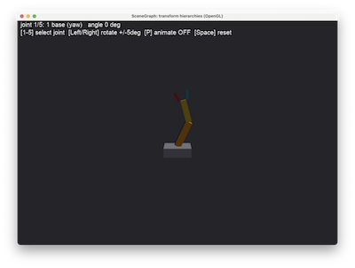</a> | [SceneGraph](SceneGraph) | A robot arm built from a minimal, unit-tested transform-hierarchy `Node` class |
| <a href="MatrixStack">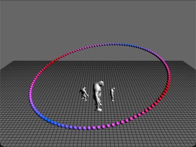</a> | [MatrixStack](MatrixStack) | Hand-rolled push/pop matrix stack driving a hierarchy of trolls and an orbiting sphere ring (OpenGL + WebGPU) |
| <a href="LookAtDemos">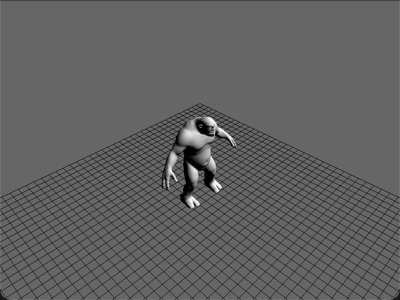</a> | [LookAtDemos](LookAtDemos) | Interactive perspective camera against a 2x2 orthographic multi-view comparison of the same scene (OpenGL + WebGPU) |
|  | [ViewToWorldTransform](ViewToWorldTransform) | Shift-click to unproject a screen position into a world-space point (OpenGL + WebGPU) |
|  | [AffineTransforms](AffineTransforms) | Translate/rotate/scale composition order (RTS vs TRS vs axis-angle) shown live against a Mat4 readout (OpenGL + WebGPU) |

## Animation

|                                             Preview                                             | Demo                                   | Description                                                                                                        |
| :---------------------------------------------------------------------------------------------: | :------------------------------------- | :----------------------------------------------------------------------------------------------------------------- |
| <a href="SkeletalAnimation">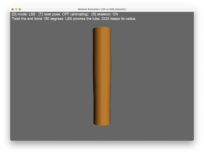</a> | [SkeletalAnimation](SkeletalAnimation) | Linear blend skinning vs dual-quaternion skinning, and the "candy wrapper" artefact that tells them apart (OpenGL) |
|           <a href="MassSpring">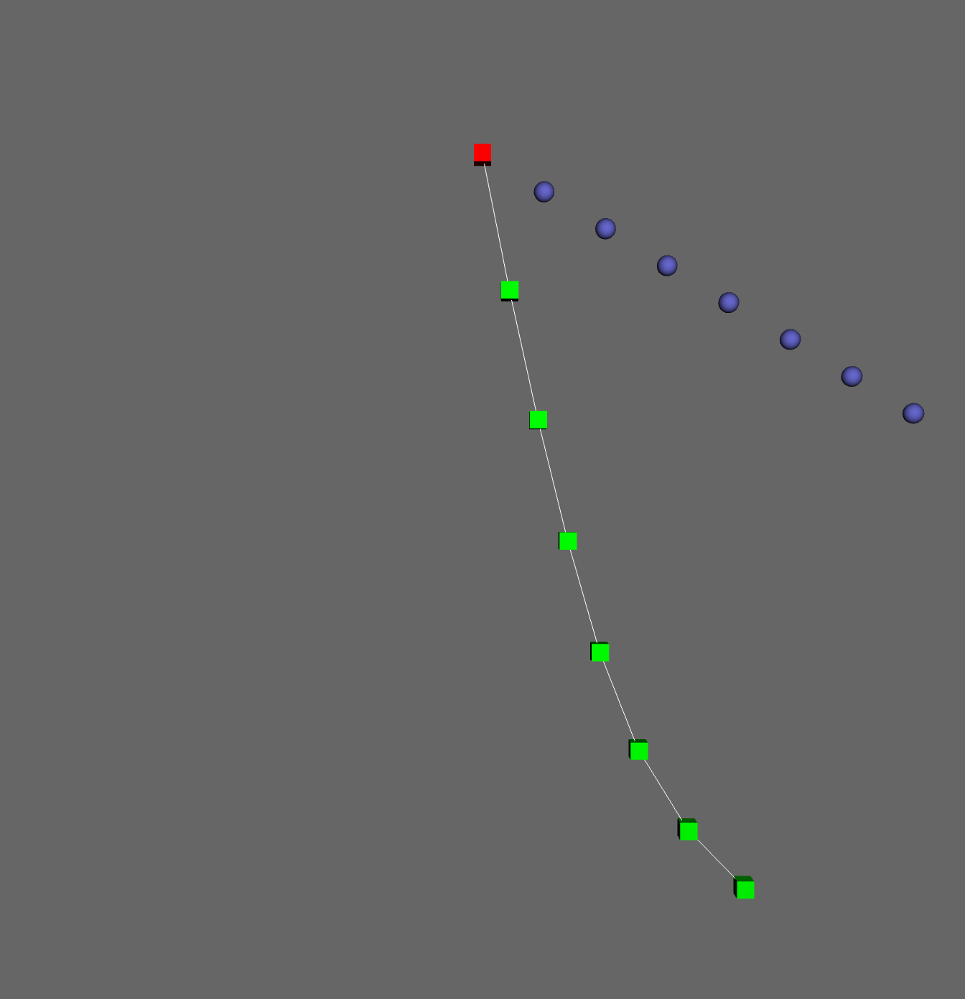</a>            | [MassSpring](MassSpring)               | Damped mass spring chain with RK4 integration, from a single spring up to a rope                                   |
| <a href="SkinnedMeshImport">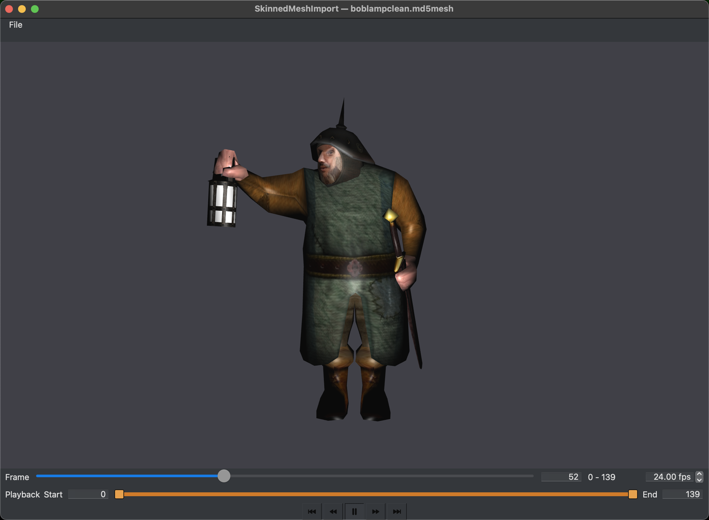</a> | [SkinnedMeshImport](SkinnedMeshImport) | Importing a rigged mesh with impasse (Python assimp) and skinning it on the GPU (OpenGL and WebGPU)                 |

## Textures & Materials

|                                           Preview                                            | Demo                                 | Description                                                                                                                                |
| :------------------------------------------------------------------------------------------: | :----------------------------------- | :----------------------------------------------------------------------------------------------------------------------------------------- |
|        <a href="SimpleTexture">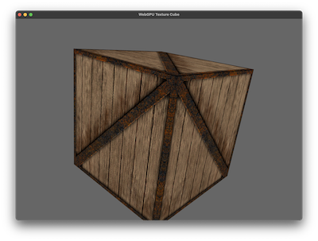</a>         | [SimpleTexture](SimpleTexture)       | Basic texture mapping                                                                                                                      |
| <a href="AnimatedTextures">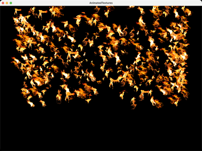</a> | [AnimatedTextures](AnimatedTextures) | Animated / scrolling textures                                                                                                              |
|            <a href="ShowMipmap">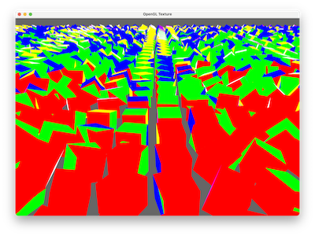</a>            | [ShowMipmap](ShowMipmap)             | Visualising mipmap levels                                                                                                                  |
|    <a href="ImageHeightMap">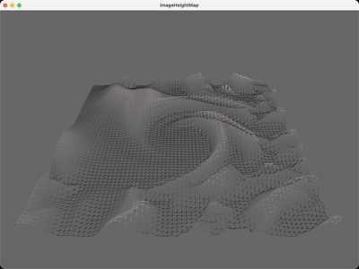</a>    | [ImageHeightMap](ImageHeightMap)     | Displacement from a height map image                                                                                                       |
|     <a href="NormalMapping">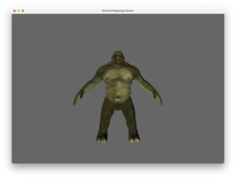</a>      | [NormalMapping](NormalMapping)       | Tangent-space normal mapping                                                                                                               |
|       <a href="PBR/SimplePBR">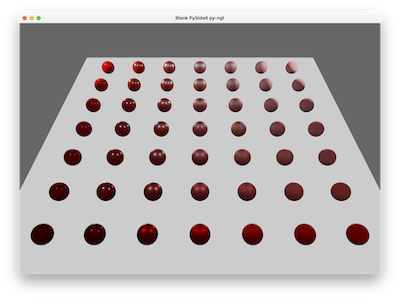</a>        | [PBR/SimplePBR](PBR/SimplePBR)       | Simple physically based rendering                                                                                                          |
|      <a href="PBR/PBRTexture">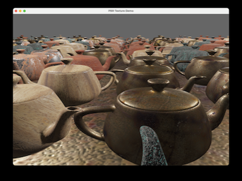</a>      | [PBR/PBRTexture](PBR/PBRTexture)     | Textured physically based rendering (OpenGL and WebGPU versions)                                                                           |
|                <a href="PBR/IBL">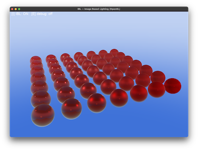</a>                 | [PBR/IBL](PBR/IBL)                   | Image-based ambient lighting for PBR: numpy-precomputed irradiance map + BRDF split-sum LUT (OpenGL)                                       |
|               <a href="PBR/HDRI">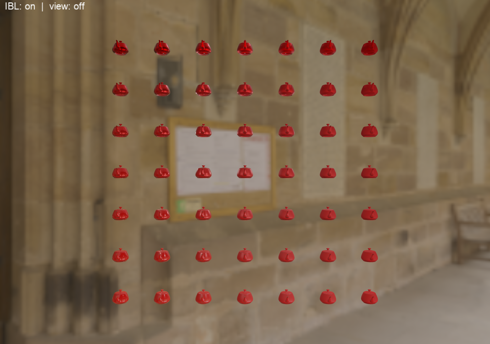</a>               | [PBR/HDRI](PBR/HDRI)                 | Full HDRI image-based lighting: GPU-baked irradiance, prefiltered specular chain and BRDF LUT from a real HDR panorama (OpenGL and WebGPU) |
|       <a href="PBR/HDRIBaker">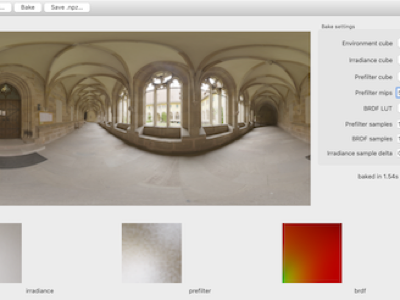</a>        | [PBR/HDRIBaker](PBR/HDRIBaker)       | Bakes the split-sum IBL maps from an HDRI to a `.npz` once, offline; a separate WebGPU demo loads them with no runtime bake                |
|          <a href="Billboards">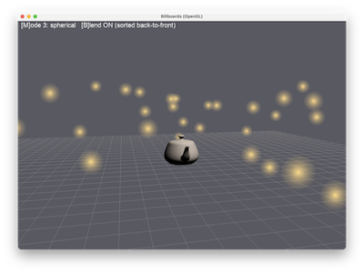</a>          | [Billboards](Billboards)             | Camera-facing quads: fixed / cylindrical / spherical billboarding modes (OpenGL)                                                           |

## Blending & Transparency

|                                   Preview                                   | Demo                             | Description                                                       |
| :-------------------------------------------------------------------------: | :------------------------------- | :---------------------------------------------------------------- |
|    <a href="Blending">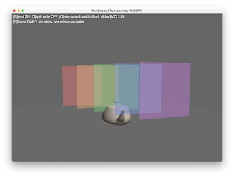</a>     | [Blending](Blending)             | Alpha blending, depth write and sorting toggles (OpenGL + WebGPU) |
| <a href="OITransparency">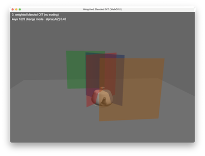</a> | [OITransparency](OITransparency) | Weighted blended order-independent transparency (OpenGL + WebGPU) |

## Environment & Sky

|                                     Preview                                      | Demo                         | Description                                                                     |
| :------------------------------------------------------------------------------: | :--------------------------- | :------------------------------------------------------------------------------ |
| <a href="SkyBoxEnvMap">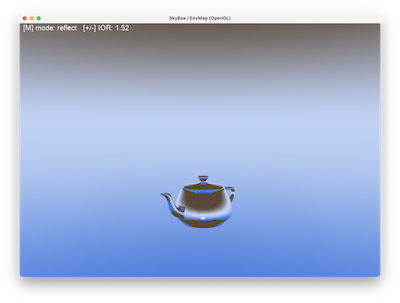</a> | [SkyBoxEnvMap](SkyBoxEnvMap) | Procedural cubemap skybox with reflect/refract/Fresnel teapot (OpenGL + WebGPU) |

## Curves & Interpolation

|                                           Preview                                            | Demo                               | Description                                                                              |
| :------------------------------------------------------------------------------------------: | :--------------------------------- | :--------------------------------------------------------------------------------------- |
|          <a href="CurveDemos">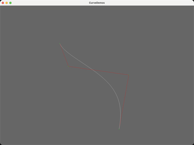</a>          | [CurveDemos](CurveDemos)           | Curve types and evaluation                                                               |
| <a href="EasingFunctions">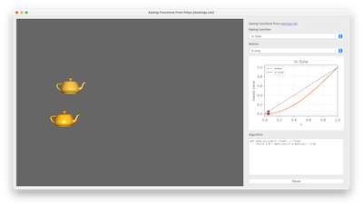</a> | [EasingFunctions](EasingFunctions) | Full Penner easing set with combo box selection and live matplotlib graph                |
|     <a href="Interpolation">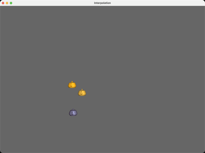</a>      | [Interpolation](Interpolation)     | Interpolation techniques                                                                 |
|           <a href="QuatSlerp">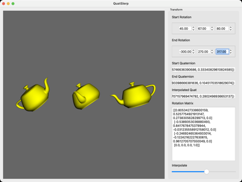</a>            | [QuatSlerp](QuatSlerp)             | Quaternion spherical interpolation                                                       |
|                    | [GimbalLock](GimbalLock)           | Euler vs quaternion orientation, side by side, with a scripted gimbal-lock demonstration |

## Selection & Picking

|                                                          Preview                                                           | Demo                                                     | Description                                                   |
| :------------------------------------------------------------------------------------------------------------------------: | :------------------------------------------------------- | :------------------------------------------------------------ |
|                          | [ColourSelectionOpenGL](ColourSelectionOpenGL)           | Unique colour-ID picking                                      |
|                       | [RayPickingSelection](RayPickingSelection)               | Ray-cast selection and manipulation                           |
|                    | [SelectionManipulator](SelectionManipulator)             | Maya-style manipulator (OpenGL)                               |
|  | [SelectionManipulatorWebGPU](SelectionManipulatorWebGPU) | Manipulator (WebGPU)                                          |
|                              | [WebGPUComputePicking](WebGPUComputePicking)             | Compute-shader picking (WebGPU)                               |
|                                      | [StencilOutline](StencilOutline)                         | Maya-style two-pass stencil-buffer selection outline (OpenGL) |

## Collision Detection

|                                       Preview                                        | Demo                                     | Description                                                                  |
| :------------------------------------------------------------------------------------: | :--------------------------------------- | :---------------------------------------------------------------------------- |
|  | [Collisions/SphereSphere](Collisions/SphereSphere) | Two moving spheres bounce off two static ones (analytic sphere/sphere test) (OpenGL + WebGPU) |
|  | [Collisions/RaySphere](Collisions/RaySphere) | N spheres tested each tick against 2 animated sweeping rays (OpenGL + WebGPU) |
|  | [Collisions/RayTriangle](Collisions/RayTriangle) | N triangles tested every frame against a keyboard-moved ray (Moller-Trumbore) (OpenGL) |

## Framebuffers & Post Processing

|                                                            Preview                                                            | Demo                                                             | Description                                     |
| :---------------------------------------------------------------------------------------------------------------------------: | :--------------------------------------------------------------- | :---------------------------------------------- |
|                                      | [FBODemos/SimpleFBO](FBODemos/SimpleFBO)                         | Simple framebuffer object                       |
|                                                     | [FBODemos/Blit](FBODemos/Blit)                                   | Blitting between framebuffers                   |
|                                                        | [FBODemos/DOF](FBODemos/DOF)                                     | Depth of field                                  |
|  | [FBODemos/WebGPURenderToTexture](FBODemos/WebGPURenderToTexture) | Render to texture (WebGPU)                      |
|                                   | [PostProcessChain](PostProcessChain)                             | HDR bloom + tonemap post-process chain (OpenGL) |

## Lighting & Shadows

|                                        Preview                                        | Demo                                 | Description                                                            |
| :-----------------------------------------------------------------------------------: | :----------------------------------- | :--------------------------------------------------------------------- |
|  | [DefferedLighting](DefferedLighting) | Deferred lighting (WebGPU)                                             |
|    | [WebGPUShadows](WebGPUShadows)       | PCF shadow mapping (WebGPU)                                            |
|    | [ShadowMapping](ShadowMapping)       | Two-pass depth-map shadows with PCF, bias and culling toggles (OpenGL) |
|                | [Spotlight](Spotlight)               | Four animated cone-attenuation spotlights sweeping a grid of teapots (OpenGL + WebGPU) |

## Ray Marching

|                                        Preview                                         | Demo                             | Description                                                                                          |
| :------------------------------------------------------------------------------------: | :------------------------------- | :--------------------------------------------------------------------------------------------------- |
|  | [RayMarchingSDF](RayMarchingSDF) | Sphere-traced signed distance fields, smooth-blended primitives, soft shadows + AO (OpenGL & WebGPU) |

## Geometry & Tessellation Shaders

|                                                 Preview                                                  | Demo                                         | Description                                                                       |
| :------------------------------------------------------------------------------------------------------: | :------------------------------------------- | :-------------------------------------------------------------------------------- |
|  | [GeometryTessellation](GeometryTessellation) | Geometry-shader normal visualiser + distance-LOD tessellated noise plane (OpenGL) |
|                                | [ShadedGrid](ShadedGrid)                     | Animated Phong-shaded wave grid with geometry-shader face/vertex normal visualisation (OpenGL) |

## Uniforms & Buffers

|                                             Preview                                             | Demo                                   | Description                                                                                                              |
| :---------------------------------------------------------------------------------------------: | :------------------------------------- | :----------------------------------------------------------------------------------------------------------------------- |
|  | [UBOStorageBuffers](UBOStorageBuffers) | UBO shared across two shader programs + std140 padding trap (OpenGL); runtime-sized storage-buffer point lights (WebGPU) |

## Compute Shaders

|                                                     Preview                                                     | Demo                                                       | Description                                                  |
| :-------------------------------------------------------------------------------------------------------------: | :--------------------------------------------------------- | :----------------------------------------------------------- |
|            | [SimpleComputeWebGPU](SimpleComputeWebGPU)                 | Simple compute shader (WebGPU)                               |
|  | [WebGPUCompute/SpatialHash2D](WebGPUCompute/SpatialHash2D) | 2D spatial hashing on the GPU                                |
|  | [WebGPUCompute/SpatialHash3D](WebGPUCompute/SpatialHash3D) | 3D spatial hashing on the GPU                                |
|                                 | [BoidsCompute](BoidsCompute)                               | Reynolds flocking with compute shaders + instanced rendering |

## WebGPU

|                                       Preview                                       | Demo                             | Description                           |
| :---------------------------------------------------------------------------------: | :------------------------------- | :------------------------------------ |
|  | [WebGPUMultiGeo](WebGPUMultiGeo) | Multiple geometry in one WebGPU scene |

## Particles & Points

|                                                 Preview                                                 | Demo                                               | Description                |
| :-----------------------------------------------------------------------------------------------------: | :------------------------------------------------- | :------------------------- |
|  | [Particles/ParticleQuads](Particles/ParticleQuads) | Billboarded particle quads |
|                               | [PointCloud](PointCloud)                           | Rendering a point cloud    |
|                                           | [Voxels](Voxels)                                   | Voxel rendering            |

## GUI

|                                                    Preview                                                     | Demo                                                   | Description                                                                                                                                     |
| :------------------------------------------------------------------------------------------------------------: | :----------------------------------------------------- | :---------------------------------------------------------------------------------------------------------------------------------------------- |
|           | [GUIDemos/PySideGUIOpenGL](GUIDemos/PySideGUIOpenGL)   | PySide GUI driving an OpenGL widget                                                                                                             |
|         | [GUIDemos/NGLWidgetsOpenGL](GUIDemos/NGLWidgetsOpenGL) | NGL widgets with OpenGL                                                                                                                         |
|                       | [GUIDemos/WebGPUGUI](GUIDemos/WebGPUGUI)               | GUI driving a WebGPU widget                                                                                                                     |
|           | [GUIDemos/QMLOverlayApp](GUIDemos/QMLOverlayApp)       | QWidget OpenGL viewport with a transparent QQuickWidget overlay of floating ncca.ngl.qml panels                                                 |
|  | [GUIDemos/QMLWebGPUOverlay](GUIDemos/QMLWebGPUOverlay) | WebGPU (offscreen) viewport with a transparent QQuickWidget overlay of floating ncca.ngl.qml panels                                             |
|               | [MathNodeEditor](MathNodeEditor)                       | PySide node editor for wiring PyNGL vector, matrix, camera, quaternion and Obj mesh operations, with a live 3D mesh viewer node                 |
|                                               | [SciFiUI](SciFiUI)                                     | Retro sci-fi CRT terminal: Unknown Pleasures style wireframe terrain fly-over, clickable buttons, scrolling log and a two-pass CRT post process |
