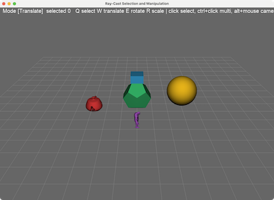

# Ray-Cast Selection and Manipulation



The same scene and Maya-style gizmos as [`SelectionManipulator`](../SelectionManipulator),
but with the **colour-ID picking replaced by analytic techniques**: CPU ray
casting for the objects and screen-space distance tests for the gizmo
handles. No ID render pass, no `glReadPixels`, no GPU stall on click.

```bash
uv run main.py          # or ./main.py
uv run main.py --debug  # re-raise exceptions swallowed by Qt event handlers
```

## Controls (Maya-style)

| Input                | Action                                                     |
| -------------------- | ---------------------------------------------------------- |
| `Q`                  | Select mode (gizmo hidden)                                 |
| `W`                  | Translate mode (arrows)                                    |
| `E`                  | Rotate mode (rings)                                        |
| `R`                  | Scale mode (boxes)                                         |
| Left click           | Select the object under the cursor (replaces selection)    |
| `Ctrl` + click       | Toggle an object in / out of the selection (multi-select)  |
| Drag an axis handle  | Transform **all** selected objects along that axis         |
| Drag the centre cube | Free screen-plane move (translate) / uniform scale (scale) |
| `Alt` + LMB drag     | Tumble the camera                                          |
| `Alt` + RMB drag     | Pan the camera                                             |
| Mouse wheel          | Dolly in / out                                             |
| `Space`              | Reset the camera                                           |
| `Escape`             | Quit                                                       |

## How it works

### Object picking: ray casting (`picking_maths.py`, `SelectionObject.py`)

On click, the mouse position is **unprojected** into a ray: the pixel is
mapped to NDC, and the NDC points on the near and far planes are pushed
through `inverse(projection @ view @ globalTx)`. Folding the scene's global
(camera-tumble) transform into that matrix means the ray comes out directly
in scene space.

Each object then answers `intersect(origin, direction)`:

1. **Transform the ray into object-local space** with one 4x4 inverse
   (`transform_ray`). The direction is _not_ re-normalised, because the
   transform is affine, a parameter `t` on the local ray measures exactly
   the same distance as `t` on the scene ray, so hit distances from
   different objects compare directly.
2. **Broad phase** — a ray/bounding-sphere test (`intersect_sphere`)
   rejects most objects with a single quadratic.
3. **Narrow phase** — vectorised **Möller–Trumbore** over the object's
   cached triangle array (`intersect_triangles`), all triangles at once in
   numpy. Tests are double-sided so picking works from any angle.

The nearest `t` across all objects wins, which fixes a subtle limitation of
colour picking for free: depth ordering is exact, and you also get the 3D
hit point (`origin + t * direction`) should you ever want snapping or
click-to-place.

The triangle data comes from the same `PrimData` arrays used to build the
GPU primitives, cached once at startup per _mesh_ (not per object) in
`load_pick_meshes()`.

### Gizmo picking: screen-space distances (`ScreenGizmo.py`)

The gizmo is never ray cast or ID-rendered. Each handle is reduced to its
screen-space skeleton and the mouse must come within `PICK_TOLERANCE`
pixels of it:

| Handle              | Skeleton                        | Test                               |
| ------------------- | ------------------------------- | ---------------------------------- |
| Arrow / scale shaft | pivot -> tip segment, projected | `point_segment_distance`           |
| Rotation ring       | 48-point circle, projected      | `point_polyline_distance` (closed) |
| Centre cube         | projected pivot point           | plain 2D distance                  |

The center cube is tested first (all three shafts meet there), then the
nearest axis under the tolerance wins. This is how real DCCs hit-test their
gizmos, and it makes the click tolerance a clean DPI-independent radius so
the colour-ID version needed a 9x9 block of readback pixels to get the same
forgiveness.

The drag mathematics (screen-projected axis, pixels-per-unit conversion,
incremental rotate/scale deltas) are identical to `SelectionManipulator`.

### Trade-offs vs colour-ID picking

- **Pro** :- no extra render pass and no pipeline-stalling readback; exact
  nearest-hit with real distances; the same maths works unchanged for
  OpenGL and WebGPU (nothing here touches the GPU).
- **Con** :- needs CPU-side triangle data, and very heavy meshes would want
  a BVH instead of a flat triangle test (the bounding-sphere broad phase is
  enough at this scene size). Colour picking stays pixel-perfect for
  _rendered_ silhouettes (e.g. alpha-tested cutouts) where geometry alone
  can't tell.

## Tests

The picking maths is numpy-only and unit tested headless:

```bash
uv run --group dev pytest RayPickingSelection/tests
```

## References

- T. Möller & B. Trumbore, "Fast, Minimum Storage Ray/Triangle Intersection", JGT 1997 — [ACM](https://dl.acm.org/doi/10.1080/10867651.1997.10487468) — the ray/triangle test used for mesh picking.
- [Scratchapixel — Möller–Trumbore ray-triangle intersection](https://www.scratchapixel.com/lessons/3d-basic-rendering/ray-tracing-rendering-a-triangle/moller-trumbore-ray-triangle-intersection.html) — worked derivation with code.
- [Anton Gerdelan — Mouse Picking with Ray Casting](https://antongerdelan.net/opengl/raycasting.html) — unprojecting the cursor into a world-space ray.
- C. Ericson, _Real-Time Collision Detection_, Morgan Kaufmann 2005 — [book site](https://realtimecollisiondetection.net/) — ray/sphere and ray/AABB tests and their numerical pitfalls.
