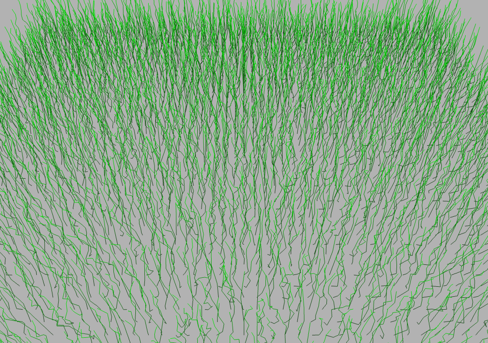

# ResetLine

This is the animated line-field demo from NGL9Demos. The OpenGL version uses
one indexed `GL_LINE_STRIP` draw with a primitive restart index between each
blade.



There is no primitive restart in WebGPU, so `main_webgpu.py` expands each blade
into independent line-list segments. Both versions start from the same seeded
geometry in `blade_field.py`.

## Running

```bash
uv run --script main.py
uv run --script main_webgpu.py
```

The original field is 120 by 120 blades. Smaller fields can be useful whilst
experimenting.

```bash
uv run --script main_webgpu.py --rows 60 --cols 60
```

## Controls

- `A` starts and stops the wind animation.
- Left-drag rotates, right-drag pans and the wheel zooms.
- Space resets the view.
- Escape quits.
