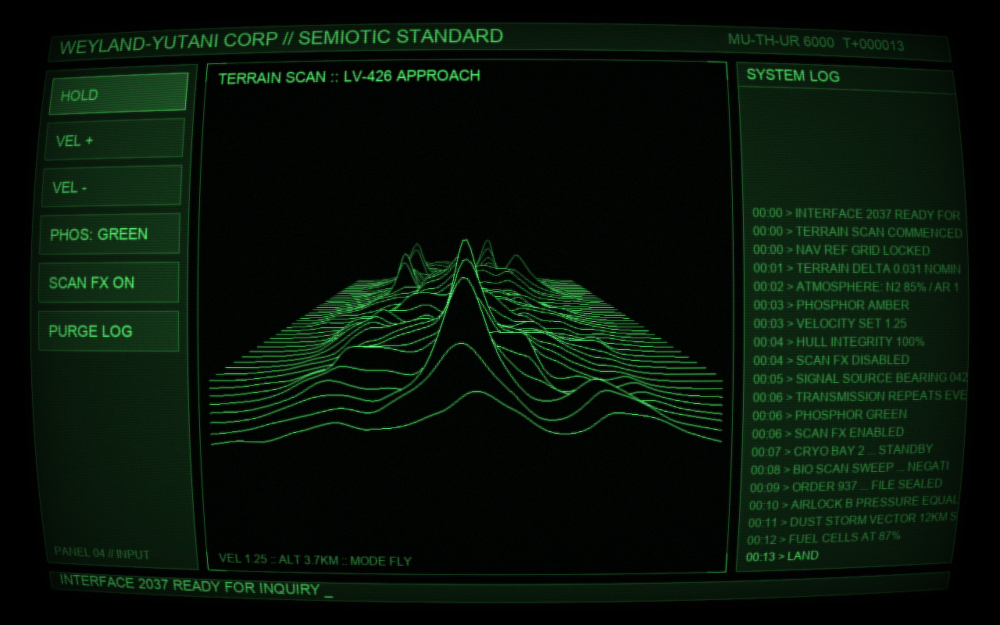

# SciFiUI



A retro sci-fi CRT terminal built entirely with `ncca.ngl` and OpenGL based on the Nostromo's [MU-TH-UR 6000](https://avp.fandom.com/wiki/MU/TH/UR_6000) from _Alien_ (1979).

The central window is a wireframe terrain fly-over drawn as stacked ridge lines in the style of the pulsar plot on [Joy Division's _Unknown Pleasures_ cover](https://en.wikipedia.org/wiki/Unknown_Pleasures). Around it sits a full terminal interface: clickable buttons on the left, a scrolling system log on the right, and header/footer status bars with a blinking cursor.

```bash
uv run SciFiUI/main.py
```

## How it works

**Two-pass CRT rendering.** The whole interface is drawn in monochrome into an FBO, then a full-screen triangle pass (`shaders/CRTFragment.glsl`) applies the CRT look: phosphor tint (green or amber), barrel distortion, scanlines, a slot mask, a slow rolling bar, per-pixel noise, mains-hum flicker and a vignette. Because the scene is monochrome and the tint is applied in post, switching between green and amber phosphor is a single uniform change.

**[Unknown Pleasures terrain](https://en.wikipedia.org/wiki/Unknown_Pleasures).** Each ridge is a `GL_LINE_STRIP` row of a height field sampled from vectorised numpy value noise, with an amplitude envelope that is quiet at the edges and active in the middle (like the original CP 1919 plot). Flight is simulated by advancing the noise-space z offset each tick and re-uploading the vertex buffers. Hidden-line removal uses no depth buffer at all: rows are drawn back to front, and each row first draws an opaque black "skirt" (a triangle strip from the ridge down to a floor) that occludes the rows behind it basically the painter's algorithm trick.

**UI without a widget toolkit.** Panels, frames and buttons are batched into one dynamic VAO in pixel coordinates each frame and drawn with an orthographic projection (`UIBatch`). Buttons are hit-tested against the mouse in framebuffer pixels, highlight on hover, flash on click, and write their actions to the system log. Text is `ncca.ngl` `Text` rendering; the log clips with a scissor rect and the newest line "types" itself out.

All rendering lives in `SciFiScene`, which knows nothing about Qt — `MainWindow` is a thin `QOpenGLWindow` shell that forwards events, so the scene can also be driven headless (e.g. by GLFW) for testing.

## Controls

| Input                             | Action                                                                                                                         |
| :-------------------------------- | :----------------------------------------------------------------------------------------------------------------------------- |
| Left click                        | Press a button                                                                                                                 |
| Left drag (in the terrain panel)  | Rotate the view (pivots about the terrain centre; angles are clamped so the painter's-algorithm hidden-line trick stays valid) |
| `R`                               | Reset the view rotation                                                                                                        |
| `HOLD` / `Space`                  | Pause / resume the fly-over                                                                                                    |
| `VEL +` / `VEL -` / `Up` / `Down` | Change flight speed                                                                                                            |
| `PHOS` / `P`                      | Toggle green / amber phosphor                                                                                                  |
| `SCAN FX` / `S`                   | Toggle the CRT effects                                                                                                         |
| `PURGE LOG`                       | Clear the system log                                                                                                           |
| `Esc`                             | Quit                                                                                                                           |
