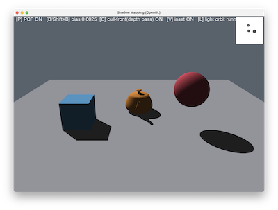

# Shadow Mapping

A two-pass depth map shadow technique using a directional light orbiting the scene that renders depth into a 2048^2 `GL_DEPTH_COMPONENT24` texture, then the main pass re-projects every fragment through the light's view-projection and compares against that stored depth.

This is deliberately the **OpenGL mirror of `WebGPUShadows`** using the same scene shape, same PCF option, same artifact toggle so the two can be diffed API-for-API to see what each backend makes explicit vs. hides.

## Controls

| Key               | Action                                                                   |
| :---------------- | :----------------------------------------------------------------------- |
| `P`               | toggle PCF (3×3 percentage-closer filtering) vs. a single shadow-map tap |
| `B` / `Shift+B`   | increase / decrease the depth bias (HUD shows the current value)         |
| `C`               | toggle front-face culling during the depth pass                          |
| `V`               | toggle the depth-map debug inset (top-right corner)                      |
| `L`               | pause / resume the light orbit                                           |
| LMB / RMB / wheel | rotate / pan / zoom, `Space` resets, `Esc` quits                         |

## The two passes

1. **Depth pass** — the scene is rendered from the light's point of view into a 2048^2 FBO holding only a `GL_DEPTH_COMPONENT24` **texture** (no colour attachment: `glDrawBuffer(GL_NONE)` / `glReadBuffer(GL_NONE)`). The light is directional, modelled as an orthographic camera orbiting the scene on a timer (`L` pauses it).
2. **Shade pass** — rendered to the default framebuffer. The vertex shader carries the fragment's world position re-projected through the light's view-projection matrix (`lightSpaceMatrix`); the fragment shader perspective-divides it, remaps `[-1,1] -> [0,1]`, and compares against `texture(shadowMap, uv).r` with a bias. `P` switches between a single tap and a 3×3 PCF kernel scaled by `textureSize(shadowMap, 0)`.
3. **Debug inset** — the raw depth texture drawn into a small screen-corner quad with its own tiny shader (own VAO in clip space, viewport shrunk to the corner rectangle). Because the light uses an _orthographic_ projection, NDC depth is already linear in view-space distance, so no extra "linearisation" maths is needed to make it legible — unlike a perspective shadow map's depth buffer.

## Teaching points

1. **Shadow mapping is "render depth from the light, then compare."** There is no magic: pass 1 is a depth-only render from a second camera (the light); pass 2 asks "is _this_ fragment's light-space depth further from the light than what's already recorded?" — if so, something else was closer to the light along that ray, so this fragment is in shadow.
2. **The comparison is done explicitly, not with `sampler2DShadow`.** A hardware shadow sampler (`sampler2DShadow` + `textureProj`) would perform the perspective divide, the `[-1,1] -> [0,1]` remap and the depth compare for you in one call — which is exactly what a first shadow-mapping demo shouldn't hide. `GL_TEXTURE_COMPARE_MODE` is deliberately left at `GL_NONE` so `texture(shadowMap, uv).r` returns a raw depth value.
3. **Every artefact you can produce here traces back to one of three things:**

| Symptom                                                                               | Cause                                                                                          | Fix in this demo                                                                                                                              |
| :------------------------------------------------------------------------------------ | :--------------------------------------------------------------------------------------------- | :-------------------------------------------------------------------------------------------------------------------------------------------- |
| Shadow acne (moiré/striping self-shadowing on lit surfaces)                           | Bias too small; the surface shadows itself due to depth-map resolution/quantisation            | `B` to increase bias                                                                                                                          |
| Peter-panning (shadow visibly detached from its caster)                               | Bias too large, or front-face culling in the depth pass pushed the recorded depth too far back | `Shift+B` to decrease bias; `C` to toggle depth-pass culling                                                                                  |
| Hard, aliased shadow edges                                                            | Single-tap shadow lookup                                                                       | `P` to enable 3×3 PCF                                                                                                                         |
| Shadows appearing outside the light's frustum, or a shadow "wall" at the frustum edge | Wrap mode tiling the shadow map (`GL_REPEAT`) instead of clamping                              | Already fixed here with `CLAMP_TO_BORDER` + border colour `(1,1,1,1)` — sampling outside the frustum always reads "far", i.e. never in shadow |

4. **Culling front faces during the depth pass** writes the shadow caster's _back_ surface depth into the shadow map instead of its front (lit) surface. That moves the acne-prone surface further from the comparison, fixing self-shadowing on convex geometry at the cost of more peter-panning on thin objects — `C` demonstrates the trade-off live.

## Diffing against `WebGPUShadows`

|                         | `ShadowMapping` (this demo, GL)                                      | `WebGPUShadows`                                                        |
| :---------------------- | :------------------------------------------------------------------- | :--------------------------------------------------------------------- |
| Depth-only pass         | Explicit FBO with `glDrawBuffer(GL_NONE)`, no fragment shader output | `fragment: None` on the render pipeline, `color_attachments=[]`        |
| Comparison              | Manual `texture(shadowMap, uv).r` vs. `currentDepth - bias`          | Manual read against a `depth24plus` texture view (also non-comparison) |
| Out-of-frustum handling | `CLAMP_TO_BORDER`, border colour `1.0`                               | Depth clamp/bias baked into the depth pipeline's `depth_bias*` fields  |
| Light projection        | CPU-built `ortho()` orthographic matrix                              | `perspective()` (a spot-light style projection)                        |

## References

- L. Williams, "Casting Curved Shadows on Curved Surfaces", SIGGRAPH 1978 — [PDF](https://cseweb.ucsd.edu/~ravir/6160-fall04/papers/p270-williams.pdf) — the original shadow-mapping paper.
- W. T. Reeves, D. H. Salesin & R. L. Cook, "Rendering Antialiased Shadows with Depth Maps", SIGGRAPH 1987 — [ACM](https://dl.acm.org/doi/10.1145/37401.37435) — the paper that introduced percentage closer filtering.
- [LearnOpenGL — Shadow Mapping](https://learnopengl.com/Advanced-Lighting/Shadows/Shadow-Mapping) — bias, peter-panning and PCF explained with GLSL.
- [OpenGL Wiki — Sampler (GLSL) / shadow samplers](<https://www.khronos.org/opengl/wiki/Sampler_(GLSL)#Shadow_samplers>) — why `sampler2DShadow` exists and what it hides.
- `WebGPUShadows/README.md` in this repo — the WebGPU sibling of this demo.
