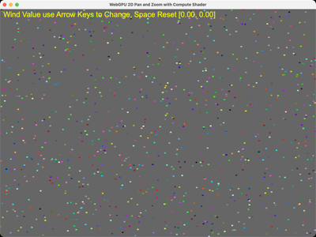

# SimpleComputeWebGPU

A minimal WebGPU compute shader example. A 2D particle simulation is updated
entirely on the GPU: `Compute.wgsl` integrates particle positions and
velocities (with a user-controlled wind force and boundary bounce) each frame,
and `PointShader.wgsl` renders the particles as points with MSAA. The view
supports 2D pan and zoom around the mouse position.

## Files

- `WebGPU2D.py` - main application (pass `-p N` to change the particle count)
- `Compute.wgsl` - compute shader updating the particle buffer
- `PointShader.wgsl` - point render shader
- `WebGPUWidget.py` - Qt widget hosting the WebGPU surface

## Controls

- Left/Right-drag : pan, Wheel : zoom (around cursor)
- Arrow keys : add wind in x / y
- `a` : toggle animation
- `space` : reset wind
- `Esc` : quit

## References

- [WebGPU Fundamentals — Compute Shader Basics](https://webgpufundamentals.org/webgpu/lessons/webgpu-compute-shaders.html) — workgroups, dispatch and storage-buffer I/O as used in `Compute.wgsl`.
- [WebGPU Fundamentals — Storage Buffers](https://webgpufundamentals.org/webgpu/lessons/webgpu-storage-buffers.html) — the read/write particle buffer shared between compute and render passes.
- [WGSL Specification](https://www.w3.org/TR/WGSL/) — the shading language.
- [wgpu-py documentation](https://wgpu-py.readthedocs.io/) — the Python WebGPU binding.
