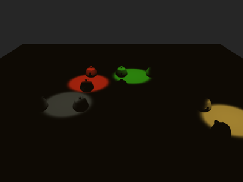

# Spotlight

Four animated spotlights sweep cones of light across a grid of teapots, each
light showing cone-attenuation falloff (a smoothstep ramp between an inner
and outer cutoff angle, raised to a spot exponent) alongside normal
distance attenuation. Lighting is computed in world space.

## Controls
- `a` : toggle light animation
Left-drag : orbit, Right-drag : pan, Wheel : zoom, `space` : reset

## WebGPU version

`main_webgpu.py` renders the same scene and lighting model as the OpenGL
version -- the same 4 orbiting spotlights, colours and cone angles -- with
a WGSL fragment shader doing the per-pixel work. WebGPU has no runtime
plane generator like `Prims.TRIANGLE_PLANE`, so the ground is a small
hand-built quad instead.

The scene draws 26 objects (25 teapots + the ground plane) in one render
pass. Each draw gets its own uniform buffer out of a pool allocated up
front, rather than one shared buffer rewritten in a loop -- WebGPU only
guarantees a submitted command buffer sees a resource's state as of just
before that submit, so a shared buffer would have every draw pick up the
last-written transform and the whole grid would collapse onto one teapot.
Same pattern as `MatrixStack/main_webgpu.py` and `LookAtDemos/main_webgpu.py`.
