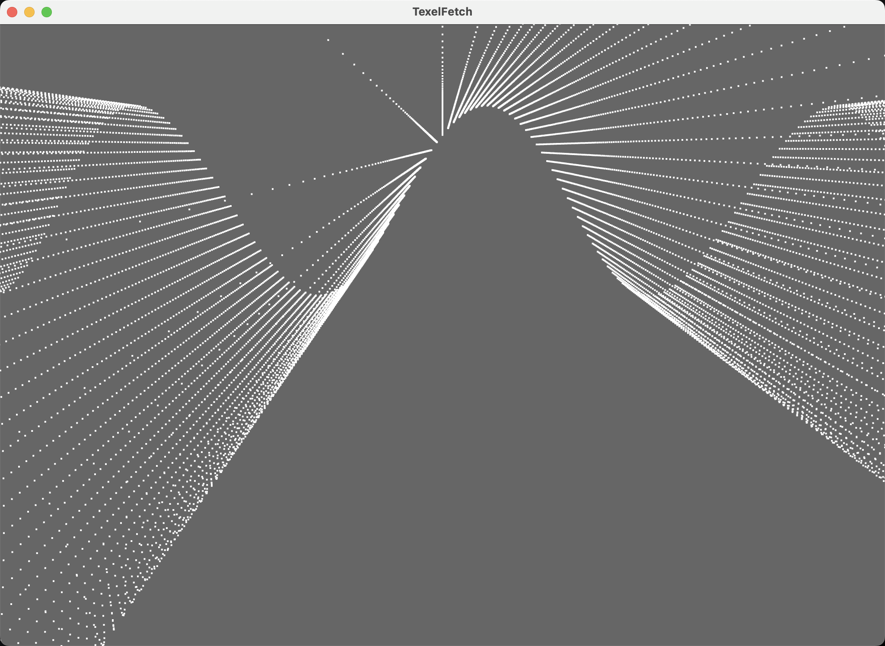

# TexelFetch

A 200x200 grid of 40,000 points whose height comes from a Texture Buffer
Object (TBO), sampled in the vertex shader with
`texelFetch(yPosSampler, gl_VertexID)` -- no second vertex attribute, no
interleaving, just per-vertex data read straight out of a buffer by its
texel index. XZ positions sit in an ordinary vertex buffer; Y lives in the
TBO and gets rebuilt and re-uploaded every 20ms
(`sin(x + offset) + cos(x - offset)`, `offset` creeping forward each tick),
so the whole grid animates without the vertex buffer itself ever changing.

There's no `ncca.ngl` wrapper for TBOs, so this one drops to raw
`OpenGL.GL` calls (`GL_TEXTURE_BUFFER`, `GL_R32F`, `glTexBuffer`) rather
than going through `ShaderLib`/`Texture`.

## Controls
- `w` / `s` : wireframe / fill (no visible effect here -- `GL_POINTS` has
  no edges to outline, ported anyway to match the source)
- `f` / `n` : fullscreen / windowed
- Left-drag : orbit, Right-drag : pan, Wheel : zoom
