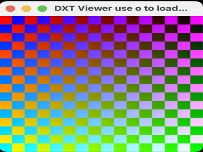

# TextureCompressor



A viewer for DXT1/S3TC block-compressed textures, ported from
`NGL9Demos/TextureCompressor/DXTViewer`.

DXT1 (a.k.a. S3TC, the ancestor of the BCn formats) compresses a texture in
fixed 4x4-pixel blocks, each stored as two 16-bit endpoint colours plus 16
2-bit palette indices -- 8 bytes per block regardless of what's in it. That
fixed rate is the entire point: a GPU can predict a compressed texture's
memory footprint from its dimensions alone, and unlike JPEG the format can
be sampled directly by the texture unit without ever decompressing to a
full RGB buffer first. The cost is quality -- 4 colours per 16 texels is a
coarse palette, and it shows on hard edges.

Files loaded and saved here follow `ngl::cmptx`, the same 10-byte-magic +
width/height/format/size binary layout the original C++ `DXTTexture::load()`
reads, so files this demo writes and files the original tool wrote are
interchangeable.

## The encoder

The C++ original links `libsquish` to do the actual DXT1 compression.
There's no Python binding for squish (or SDL2_image, which the C++
`Compressor` tool used to read source images) in this environment, so
`dxt_texture.py` is a from-scratch numpy encoder instead: for each 4x4
block, project the 16 texels onto their dominant colour axis (PCA via
`np.linalg.eigh` on the block's covariance), take the two extreme points
along that axis as the 565-packed endpoints, derive the standard 4-colour
DXT1 palette, and assign each texel to its nearest palette entry. It's not
cluster-fit -- squish searches for better endpoints, this just picks the
extremes -- but it's spec-correct DXT1 any GPU decodes normally, and the
extra blockiness on hard edges is if anything a more honest picture of
what block compression costs you.

`compress_texture.py` is the CLI that drives it -- image in, `.cmptx` out:

```bash
uv run --script compress_texture.py input.png -o output.cmptx
```

`textures/source.png` and `textures/texture.cmptx` are a synthetic
checker/gradient test pattern generated by `dxt_texture.make_test_pattern()`
and its compressed form, bundled so this folder has no dependency on any
image sitting in another demo's folder.

## Scope

Only DXT1 (opaque, 4-colour blocks) is implemented. The C++ source's DXT3
and DXT5 variants add per-pixel alpha and would roughly double the size of
a from-scratch encoder for no extra teaching value here -- DXT1 already
shows the block/endpoint/palette idea in full. `PackViewer`, the C++
sibling that steps through a multi-texture `.pack` file with a reusable
`TexturePack` class, isn't ported either: its interesting bit -- looking
up several textures per material by name -- already exists in this repo as
`PBR/PBRTexture`'s JSON-driven texture pack, and porting `PackViewer` here
would mostly duplicate that rather than teach anything new about
compression.

One other deliberate deviation from the source: its fragment shader reads
`.bgr` off the sampled texture, because squish's compressed output stores
channels in BGR order. This encoder compresses straight RGB, so
`TextureFragment.glsl` reads plain `.rgb` -- using `.bgr` here would just
swap red and blue for no reason.

## Controls
- `o` : open a file dialog and load a different `.cmptx` file
- `f` / `n` : fullscreen / windowed
- `Esc` : quit

There's no camera in this one -- the quad already covers the screen in
clip space, so the usual orbit/pan/zoom mouse handling is wired up for
consistency with the rest of this repo but has nothing to actually move.

`main.py --file some.cmptx` preloads a specific file instead of the
bundled sample, matching the C++ `main()`'s first-command-line-argument
behaviour.
