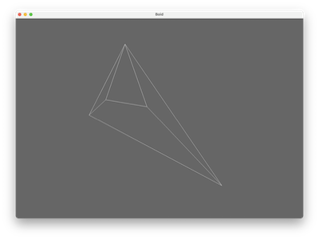

# Boid

This demo shows how to create a simple Boid shaped VertexArrayObject using just vertices. It uses the SimpleVAO factory to create the VertexArrayObject from a list of vertices stored in the Vec3Array class.

## References

- [OpenGL Wiki — Vertex Specification](https://www.khronos.org/opengl/wiki/Vertex_Specification) — VAOs, VBOs and attribute pointers.
- [LearnOpenGL — Hello Triangle](https://learnopengl.com/Getting-started/Hello-Triangle) — the same buffer/attribute setup from first principles.
