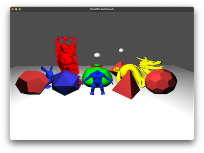

# WebGPU Multi Geo



This demo shows how to render multiple mesh objects within a single WebGPU draw call. Geometry is consolidated into one vertex buffer and the per-instance data (model transform, normal matrix and colour) lives in a storage buffer the vertex shader indexes with the built-in `instance_index`.

Basic diffuse shading is used, with buffers set up to have Camera (view, project, eye) and light (position and colour) values passed per frame.

## How it works

`WebGPUMultiGeo.py` is the main window: it sets up the WebGPU device, handles the FirstPersonCamera mouse and keyboard input, and holds the `scene_objects` list of transforms and colours. `Pipeline.py` owns the render pipeline, the WGSL shader and the camera / light uniform buffers. `MeshData.py` does the consolidation — `add_geometry()` stores the raw vertex data for each unique mesh shape once, `add_mesh()` creates a named instance of one of those geometries, and `create_buffers()` packs everything into a single large vertex buffer plus a storage buffer of per-instance data.

Each frame the scene updates the camera and light, writes every object's transform and colour into the host-side storage array via `update_mesh_storage_buffer()`, then `render()` uploads the whole array to the GPU storage buffer and issues one `draw()` for the lot. The vertex shader looks up each instance's matrix and colour from the storage buffer, so one set of geometry renders in many positions with different appearances.

```bash
uv run WebGPUMultiGeo/WebGPUMultiGeo.py
```

## References

- [WebGPU Fundamentals — Storage Buffers](https://webgpufundamentals.org/webgpu/lessons/webgpu-storage-buffers.html) — per-instance transforms/colours in a storage buffer indexed in the shader.
- [WebGPU Specification](https://www.w3.org/TR/webgpu/) — bind groups, buffer usage flags and draw calls.
- [LearnOpenGL — Instancing](https://learnopengl.com/Advanced-OpenGL/Instancing) — the same consolidate-the-draw-calls idea in its OpenGL form.
